README.md

This file provides the markdown representation for the analysis notebook (primaryAnalysisNotebook.ipynb) included in this repository. To run this locally, you will need Python 3, a few standard libraries (see the Imports section, below), and Jupyter. Once these are installed, clone this repo and open the notebook with Jupyter. All requisite data files are included in the ref/ folder and should already be appropriately referenced with a relative path string in the notebook. If you run into any issues or have suggestions about how this could be improved, please don't hesitate to contact me (or make a pull request)!

A few additional notes:
- Where appropriate, a parenthetical is included in the section heading to denote panel(s) to which said section pertains.
- Note that running the permutations may yield values slightly different from the manuscript.
- The below path strings do make the assumption you are on a *nix system (i.e. Linux or Mac). If you are on a Windows machine, replacing the "/" in path names with "\\" should fix any problems you encounter.

# Setup

## Imports


```python
%matplotlib inline

import numpy as np
import matplotlib.pyplot as plt
import matplotlib as mpl
import pandas as pd
import pickle
from glob import glob
import re
import seaborn as sns
import statsmodels.api as sm

from scipy.stats import zscore, norm, rankdata
from sklearn.neighbors import KernelDensity
from sklearn.model_selection import GridSearchCV
from collections import Counter
from random import random

from matplotlib.patches import Rectangle
```

## Functions


```python
# Convenience function for rounding and display of decimal values as scientific notation.
def formatx10(floatNum):
    floatNum = str(floatNum)
    if 'e' in floatNum:
        exp = str(int(floatNum[floatNum.index('e')+1:]))
        floatNum = floatNum[:floatNum.index('e')] + ' x 10' + r'$^{}$'.format(exp)
        floatNum = floatNum.replace('$^', '|||^{')
        floatNum = floatNum.replace('$', '}$')
        floatNum = floatNum.replace('|||', '$')
        return(floatNum)
    else:
        return(floatNum)
```


```python
# Function to generate the kernel density over a list of observed data points.
def kdestimate(x, x_grid, bandwidth=None, **kwargs):
    if bandwidth == None:
        grid = GridSearchCV(KernelDensity(),
                    {'bandwidth': np.linspace(x_grid.max()*0.01, x_grid.max()*0.1, 20)},
                    cv=20)
        grid.fit(x[:, None])
        bandwidth = grid.best_params_['bandwidth']
        print('bandwidth =', bandwidth)
    
    kde = KernelDensity(bandwidth=bandwidth, **kwargs)
    kde.fit(x[:, np.newaxis])
    log_pdf = kde.score_samples(x_grid[:, np.newaxis])
    
    return np.exp(log_pdf)
```


```python
# Formatting function for plot axes.
# See http://matplotlib.org/examples/pylab_examples/spine_placement_demo.html
def adjust_spines(ax, spines):
    for loc, spine in ax.spines.items():
        if loc in spines:
            spine.set_position(('outward', 10))
            spine.set_smart_bounds(True)
        else:
            spine.set_color('none')

    # Turn off ticks where there is no spine in arguments.
    if 'left' in spines:
        ax.yaxis.set_ticks_position('left')
    else:
        ax.yaxis.set_ticks([])

    if 'bottom' in spines:
        ax.xaxis.set_ticks_position('bottom')
    else:
        ax.xaxis.set_ticks([])
```


```python
# Formatting function for removing plot frame.
def removeAxes(ax):
    ax.tick_params(
    axis='y',
    which='both',
    left=False,
    right=False,
    labelleft=False)

    ax.tick_params(
        axis='x',
        which='both',
        top=False,
        bottom=False,
        labelbottom=False)

    ax.spines["top"].set_visible(False)
    ax.spines["right"].set_visible(False)
    ax.spines["bottom"].set_visible(False)
    ax.spines["left"].set_visible(False)
```

## Dataframes

### shref


```python
# shref contains the info about each hairpin
shref = pd.read_csv('ref/shref.csv')
print(shref.shape)
shref.head()
```

    (2803, 28)


<div>
<style scoped>
    .dataframe tbody tr th:only-of-type {
        vertical-align: middle;
    }

    .dataframe tbody tr th {
        vertical-align: top;
    }

    .dataframe thead th {
        text-align: right;
    }
</style>
<table border="1" class="dataframe">
  <thead>
    <tr style="text-align: right;">
      <th></th>
      <th>id</th>
      <th>shrna</th>
      <th>seed</th>
      <th>type</th>
      <th>gene</th>
      <th>chr</th>
      <th>gWindowStart</th>
      <th>gWindowEnd</th>
      <th>snp</th>
      <th>snpPos</th>
      <th>...</th>
      <th>pheno-r2d9</th>
      <th>pheno-r2d12</th>
      <th>pheno-r2d14</th>
      <th>pheno-r2d16</th>
      <th>pheno-r3d4</th>
      <th>pheno-r3d6</th>
      <th>pheno-r3d9</th>
      <th>pheno-r3d12</th>
      <th>pheno-r3d14</th>
      <th>pheno-r3d16</th>
    </tr>
  </thead>
  <tbody>
    <tr>
      <th>0</th>
      <td>sr0001</td>
      <td>GCCAGCACTATACCATTGTT</td>
      <td>AACAATG</td>
      <td>gwa</td>
      <td>ATP2B4</td>
      <td>chr1</td>
      <td>203485914.0</td>
      <td>203753209.0</td>
      <td>rs7551442</td>
      <td>203655121.0</td>
      <td>...</td>
      <td>1263</td>
      <td>504</td>
      <td>197</td>
      <td>283</td>
      <td>9648</td>
      <td>4306</td>
      <td>897</td>
      <td>394</td>
      <td>392</td>
      <td>240</td>
    </tr>
    <tr>
      <th>1</th>
      <td>sr0002</td>
      <td>CCGGACTATCTGCATAGCTT</td>
      <td>AAGCTAT</td>
      <td>gwa</td>
      <td>ATP2B4</td>
      <td>chr1</td>
      <td>203485914.0</td>
      <td>203753209.0</td>
      <td>rs7551442</td>
      <td>203655121.0</td>
      <td>...</td>
      <td>224</td>
      <td>85</td>
      <td>45</td>
      <td>66</td>
      <td>587</td>
      <td>480</td>
      <td>63</td>
      <td>33</td>
      <td>29</td>
      <td>42</td>
    </tr>
    <tr>
      <th>2</th>
      <td>sr0003</td>
      <td>CCTGATTCTATACTTTGTGA</td>
      <td>TCACAAA</td>
      <td>gwa</td>
      <td>ATP2B4</td>
      <td>chr1</td>
      <td>203485914.0</td>
      <td>203753209.0</td>
      <td>rs7551442</td>
      <td>203655121.0</td>
      <td>...</td>
      <td>332</td>
      <td>159</td>
      <td>85</td>
      <td>101</td>
      <td>734</td>
      <td>492</td>
      <td>144</td>
      <td>129</td>
      <td>124</td>
      <td>51</td>
    </tr>
    <tr>
      <th>3</th>
      <td>sr0004</td>
      <td>GCTGAGATTGTGGTTGGTGA</td>
      <td>TCACCAA</td>
      <td>gwa</td>
      <td>ATP2B4</td>
      <td>chr1</td>
      <td>203485914.0</td>
      <td>203753209.0</td>
      <td>rs7551442</td>
      <td>203655121.0</td>
      <td>...</td>
      <td>1029</td>
      <td>547</td>
      <td>195</td>
      <td>315</td>
      <td>10219</td>
      <td>2908</td>
      <td>474</td>
      <td>290</td>
      <td>252</td>
      <td>191</td>
    </tr>
    <tr>
      <th>4</th>
      <td>sr0005</td>
      <td>GATGCACTGACCCAGATTAA</td>
      <td>TTAATCT</td>
      <td>gwa</td>
      <td>ATP2B4</td>
      <td>chr1</td>
      <td>203485914.0</td>
      <td>203753209.0</td>
      <td>rs7551442</td>
      <td>203655121.0</td>
      <td>...</td>
      <td>304</td>
      <td>146</td>
      <td>71</td>
      <td>62</td>
      <td>5846</td>
      <td>1231</td>
      <td>151</td>
      <td>21</td>
      <td>80</td>
      <td>55</td>
    </tr>
  </tbody>
</table>
<p>5 rows × 28 columns</p>
</div>


### annoref


```python
# annoref contains annotation information for each gene in the screen
annoref = pd.read_csv('ref/annoFinal.csv')
print(annoref.shape)
annoref.head()
```

    (419, 17)


<div>
<style scoped>
    .dataframe tbody tr th:only-of-type {
        vertical-align: middle;
    }

    .dataframe tbody tr th {
        vertical-align: top;
    }

    .dataframe thead th {
        text-align: right;
    }
</style>
<table border="1" class="dataframe">
  <thead>
    <tr style="text-align: right;">
      <th></th>
      <th>gene</th>
      <th>anno</th>
      <th>exclude</th>
      <th>chr</th>
      <th>gWindowStart</th>
      <th>gWindowEnd</th>
      <th>snp</th>
      <th>ldsnp</th>
      <th>ldstart</th>
      <th>ldend</th>
      <th>rcsnp</th>
      <th>rcstart</th>
      <th>rcend</th>
      <th>closestLDsnp</th>
      <th>distanceToLD</th>
      <th>closestRCsnp</th>
      <th>distanceToRC</th>
    </tr>
  </thead>
  <tbody>
    <tr>
      <th>0</th>
      <td>ABCF1</td>
      <td>gwa</td>
      <td>NaN</td>
      <td>chr6</td>
      <td>30429169.0</td>
      <td>30599309.0</td>
      <td>rs2097775</td>
      <td>NaN</td>
      <td>NaN</td>
      <td>NaN</td>
      <td>NaN</td>
      <td>NaN</td>
      <td>NaN</td>
      <td>NaN</td>
      <td>NaN</td>
      <td>NaN</td>
      <td>NaN</td>
    </tr>
    <tr>
      <th>1</th>
      <td>ABO</td>
      <td>gwa</td>
      <td>NaN</td>
      <td>chr9</td>
      <td>136090562.0</td>
      <td>136260630.0</td>
      <td>rs579459</td>
      <td>rs579459</td>
      <td>136141870.0</td>
      <td>136155000.0</td>
      <td>NaN</td>
      <td>NaN</td>
      <td>NaN</td>
      <td>NaN</td>
      <td>NaN</td>
      <td>NaN</td>
      <td>NaN</td>
    </tr>
    <tr>
      <th>2</th>
      <td>ACAD10</td>
      <td>gwa</td>
      <td>NaN</td>
      <td>chr12</td>
      <td>112013856.0</td>
      <td>112188121.0</td>
      <td>rs3184504</td>
      <td>rs3184504</td>
      <td>111833788.0</td>
      <td>112883476.0</td>
      <td>NaN</td>
      <td>NaN</td>
      <td>NaN</td>
      <td>NaN</td>
      <td>NaN</td>
      <td>NaN</td>
      <td>NaN</td>
    </tr>
    <tr>
      <th>3</th>
      <td>ACADS</td>
      <td>gwa</td>
      <td>NaN</td>
      <td>chr12</td>
      <td>121053570.0</td>
      <td>121217811.0</td>
      <td>rs3829290</td>
      <td>rs3829290</td>
      <td>121101152.0</td>
      <td>121184931.0</td>
      <td>NaN</td>
      <td>NaN</td>
      <td>NaN</td>
      <td>NaN</td>
      <td>NaN</td>
      <td>NaN</td>
      <td>NaN</td>
    </tr>
    <tr>
      <th>4</th>
      <td>ACD</td>
      <td>gwa</td>
      <td>NaN</td>
      <td>chr16</td>
      <td>67651414.0</td>
      <td>67804718.0</td>
      <td>rs2271294</td>
      <td>rs2271294</td>
      <td>67699948.0</td>
      <td>68013471.0</td>
      <td>NaN</td>
      <td>NaN</td>
      <td>NaN</td>
      <td>NaN</td>
      <td>NaN</td>
      <td>NaN</td>
      <td>NaN</td>
    </tr>
  </tbody>
</table>
</div>


### traitref


```python
# traitref contains info for the snp-phenotype associations from van der Harst et al., 2012
traitref = pd.read_csv('ref/associatedTraits.csv')
print(traitref.shape)
traitref.head()
```

    (8586, 12)


<div>
<style scoped>
    .dataframe tbody tr th:only-of-type {
        vertical-align: middle;
    }

    .dataframe tbody tr th {
        vertical-align: top;
    }

    .dataframe thead th {
        text-align: right;
    }
</style>
<table border="1" class="dataframe">
  <thead>
    <tr style="text-align: right;">
      <th></th>
      <th>SNP</th>
      <th>Chr</th>
      <th>Position</th>
      <th>Allele1</th>
      <th>Allele2</th>
      <th>Freq1</th>
      <th>Pheno</th>
      <th>Effect</th>
      <th>StdErr</th>
      <th>Weight</th>
      <th>P_value</th>
      <th>GENE</th>
    </tr>
  </thead>
  <tbody>
    <tr>
      <th>0</th>
      <td>rs1175550</td>
      <td>1</td>
      <td>3681388</td>
      <td>a</td>
      <td>g</td>
      <td>0.76</td>
      <td>MCHC</td>
      <td>-0.0167</td>
      <td>0.0043</td>
      <td>50425</td>
      <td>8.617000e-15</td>
      <td>CCDC27</td>
    </tr>
    <tr>
      <th>1</th>
      <td>rs1175549</td>
      <td>1</td>
      <td>3681587</td>
      <td>a</td>
      <td>c</td>
      <td>0.74</td>
      <td>MCHC</td>
      <td>-0.0171</td>
      <td>0.0041</td>
      <td>52093</td>
      <td>1.348000e-14</td>
      <td>CCDC27</td>
    </tr>
    <tr>
      <th>2</th>
      <td>rs2799182</td>
      <td>1</td>
      <td>3685860</td>
      <td>t</td>
      <td>c</td>
      <td>0.52</td>
      <td>MCHC</td>
      <td>-0.0085</td>
      <td>0.0035</td>
      <td>52083</td>
      <td>1.064000e-07</td>
      <td>LRRC47</td>
    </tr>
    <tr>
      <th>3</th>
      <td>rs8379</td>
      <td>1</td>
      <td>3686750</td>
      <td>a</td>
      <td>c</td>
      <td>0.52</td>
      <td>MCHC</td>
      <td>-0.0096</td>
      <td>0.0034</td>
      <td>56473</td>
      <td>1.761000e-08</td>
      <td>LRRC47</td>
    </tr>
    <tr>
      <th>4</th>
      <td>rs7513053</td>
      <td>1</td>
      <td>3699347</td>
      <td>a</td>
      <td>g</td>
      <td>0.72</td>
      <td>MCHC</td>
      <td>-0.0195</td>
      <td>0.0040</td>
      <td>56063</td>
      <td>4.262000e-13</td>
      <td>LRRC47</td>
    </tr>
  </tbody>
</table>
</div>


### snpref


```python
# snpref contains information about the snps examined in this screen
snpref = pd.read_csv('ref/snpref.csv')
print(snpref.shape)
snpref.head()
```

    (75, 16)


<div>
<style scoped>
    .dataframe tbody tr th:only-of-type {
        vertical-align: middle;
    }

    .dataframe tbody tr th {
        vertical-align: top;
    }

    .dataframe thead th {
        text-align: right;
    }
</style>
<table border="1" class="dataframe">
  <thead>
    <tr style="text-align: right;">
      <th></th>
      <th>SNP</th>
      <th>Chromosome</th>
      <th>chromPosition</th>
      <th>Allele1</th>
      <th>Allele2</th>
      <th>Contig</th>
      <th>contigPosition</th>
      <th>Band</th>
      <th>dbSNP</th>
      <th>HapMap</th>
      <th>blockStart</th>
      <th>blockEnd</th>
      <th>ldstart</th>
      <th>ldend</th>
      <th>rcstart</th>
      <th>rcend</th>
    </tr>
  </thead>
  <tbody>
    <tr>
      <th>0</th>
      <td>rs1175550</td>
      <td>chr1</td>
      <td>3691528</td>
      <td>A</td>
      <td>G</td>
      <td>GL000003.1</td>
      <td>3170160</td>
      <td>p36.32</td>
      <td>rs1175550</td>
      <td>rs1175550</td>
      <td>3684954</td>
      <td>3697292</td>
      <td>3691528</td>
      <td>3691727</td>
      <td>3679774</td>
      <td>3785319</td>
    </tr>
    <tr>
      <th>1</th>
      <td>rs3916164</td>
      <td>chr1</td>
      <td>40069939</td>
      <td>G</td>
      <td>A</td>
      <td>GL000006.1</td>
      <td>10041857</td>
      <td>p34.3</td>
      <td>rs3916164</td>
      <td>rs3916164</td>
      <td>39992878</td>
      <td>40087765</td>
      <td>40069939</td>
      <td>40073011</td>
      <td>39937695</td>
      <td>40096053</td>
    </tr>
    <tr>
      <th>2</th>
      <td>rs741959</td>
      <td>chr1</td>
      <td>47676233</td>
      <td>A</td>
      <td>G</td>
      <td>GL000006.1</td>
      <td>17648151</td>
      <td>p33</td>
      <td>rs741959</td>
      <td>rs741959</td>
      <td>47670525</td>
      <td>47708113</td>
      <td>47670525</td>
      <td>47707027</td>
      <td>47649798</td>
      <td>47710551</td>
    </tr>
    <tr>
      <th>3</th>
      <td>rs857684</td>
      <td>chr1</td>
      <td>158575729</td>
      <td>C</td>
      <td>T</td>
      <td>GL000016.1</td>
      <td>10064371</td>
      <td>q23.1</td>
      <td>rs857684</td>
      <td>rs857684</td>
      <td>158453439</td>
      <td>158631172</td>
      <td>158569874</td>
      <td>158587143</td>
      <td>158551328</td>
      <td>158619728</td>
    </tr>
    <tr>
      <th>4</th>
      <td>rs7529925</td>
      <td>chr1</td>
      <td>199007208</td>
      <td>C</td>
      <td>T</td>
      <td>GL000016.1</td>
      <td>50495850</td>
      <td>q32.1</td>
      <td>rs7529925</td>
      <td>rs7529925</td>
      <td>198974904</td>
      <td>199012479</td>
      <td>198990494</td>
      <td>199010721</td>
      <td>198773470</td>
      <td>199015079</td>
    </tr>
  </tbody>
</table>
</div>


### The phenotypic fold changes (calibrated to 0 for d4) as CPM


```python
pheno = shref.copy()
pheno[[x for x in pheno.columns if 'pheno-r' in x]] = np.log2((pheno[[x for x in pheno.columns if 'pheno-r' in x]].values / pheno[[x for x in pheno.columns if 'pheno-r' in x]].sum().values * 1e6)+1)
pheno.head()
```


<div>
<style scoped>
    .dataframe tbody tr th:only-of-type {
        vertical-align: middle;
    }

    .dataframe tbody tr th {
        vertical-align: top;
    }

    .dataframe thead th {
        text-align: right;
    }
</style>
<table border="1" class="dataframe">
  <thead>
    <tr style="text-align: right;">
      <th></th>
      <th>id</th>
      <th>shrna</th>
      <th>seed</th>
      <th>type</th>
      <th>gene</th>
      <th>chr</th>
      <th>gWindowStart</th>
      <th>gWindowEnd</th>
      <th>snp</th>
      <th>snpPos</th>
      <th>...</th>
      <th>pheno-r2d9</th>
      <th>pheno-r2d12</th>
      <th>pheno-r2d14</th>
      <th>pheno-r2d16</th>
      <th>pheno-r3d4</th>
      <th>pheno-r3d6</th>
      <th>pheno-r3d9</th>
      <th>pheno-r3d12</th>
      <th>pheno-r3d14</th>
      <th>pheno-r3d16</th>
    </tr>
  </thead>
  <tbody>
    <tr>
      <th>0</th>
      <td>sr0001</td>
      <td>GCCAGCACTATACCATTGTT</td>
      <td>AACAATG</td>
      <td>gwa</td>
      <td>ATP2B4</td>
      <td>chr1</td>
      <td>203485914.0</td>
      <td>203753209.0</td>
      <td>rs7551442</td>
      <td>203655121.0</td>
      <td>...</td>
      <td>8.168618</td>
      <td>7.216856</td>
      <td>6.431004</td>
      <td>6.854079</td>
      <td>9.272318</td>
      <td>9.080030</td>
      <td>8.437203</td>
      <td>7.973226</td>
      <td>7.506765</td>
      <td>7.469177</td>
    </tr>
    <tr>
      <th>1</th>
      <td>sr0002</td>
      <td>CCGGACTATCTGCATAGCTT</td>
      <td>AAGCTAT</td>
      <td>gwa</td>
      <td>ATP2B4</td>
      <td>chr1</td>
      <td>203485914.0</td>
      <td>203753209.0</td>
      <td>rs7551442</td>
      <td>203655121.0</td>
      <td>...</td>
      <td>5.696405</td>
      <td>4.695998</td>
      <td>4.356206</td>
      <td>4.794245</td>
      <td>5.269092</td>
      <td>5.935881</td>
      <td>4.659593</td>
      <td>4.457044</td>
      <td>3.846062</td>
      <td>4.992486</td>
    </tr>
    <tr>
      <th>2</th>
      <td>sr0003</td>
      <td>CCTGATTCTATACTTTGTGA</td>
      <td>TCACAAA</td>
      <td>gwa</td>
      <td>ATP2B4</td>
      <td>chr1</td>
      <td>203485914.0</td>
      <td>203753209.0</td>
      <td>rs7551442</td>
      <td>203655121.0</td>
      <td>...</td>
      <td>6.255011</td>
      <td>5.573350</td>
      <td>5.240208</td>
      <td>5.389931</td>
      <td>5.584000</td>
      <td>5.970930</td>
      <td>5.819766</td>
      <td>6.374147</td>
      <td>5.863295</td>
      <td>5.264574</td>
    </tr>
    <tr>
      <th>3</th>
      <td>sr0004</td>
      <td>GCTGAGATTGTGGTTGGTGA</td>
      <td>TCACCAA</td>
      <td>gwa</td>
      <td>ATP2B4</td>
      <td>chr1</td>
      <td>203485914.0</td>
      <td>203753209.0</td>
      <td>rs7551442</td>
      <td>203655121.0</td>
      <td>...</td>
      <td>7.874147</td>
      <td>7.334211</td>
      <td>6.416454</td>
      <td>7.007362</td>
      <td>9.355140</td>
      <td>8.514990</td>
      <td>7.520692</td>
      <td>7.533141</td>
      <td>6.873735</td>
      <td>7.141803</td>
    </tr>
    <tr>
      <th>4</th>
      <td>sr0005</td>
      <td>GATGCACTGACCCAGATTAA</td>
      <td>TTAATCT</td>
      <td>gwa</td>
      <td>ATP2B4</td>
      <td>chr1</td>
      <td>203485914.0</td>
      <td>203753209.0</td>
      <td>rs7551442</td>
      <td>203655121.0</td>
      <td>...</td>
      <td>6.129638</td>
      <td>5.452987</td>
      <td>4.988071</td>
      <td>4.707398</td>
      <td>8.551055</td>
      <td>7.280156</td>
      <td>5.887062</td>
      <td>3.842022</td>
      <td>5.244593</td>
      <td>5.370776</td>
    </tr>
  </tbody>
</table>
<p>5 rows × 28 columns</p>
</div>


```python
phenoRaw = pheno.copy()
```


```python
# Calibrate to day 4 value
for r in ['pheno-r1', 'pheno-r2', 'pheno-r3']:
    adjust = pheno[r + 'd4'].values.copy()
    for col in [x for x in pheno.columns if r in x]:
        pheno[col] = pheno[col].values - adjust
pheno.head()
```


<div>
<style scoped>
    .dataframe tbody tr th:only-of-type {
        vertical-align: middle;
    }

    .dataframe tbody tr th {
        vertical-align: top;
    }

    .dataframe thead th {
        text-align: right;
    }
</style>
<table border="1" class="dataframe">
  <thead>
    <tr style="text-align: right;">
      <th></th>
      <th>id</th>
      <th>shrna</th>
      <th>seed</th>
      <th>type</th>
      <th>gene</th>
      <th>chr</th>
      <th>gWindowStart</th>
      <th>gWindowEnd</th>
      <th>snp</th>
      <th>snpPos</th>
      <th>...</th>
      <th>pheno-r2d9</th>
      <th>pheno-r2d12</th>
      <th>pheno-r2d14</th>
      <th>pheno-r2d16</th>
      <th>pheno-r3d4</th>
      <th>pheno-r3d6</th>
      <th>pheno-r3d9</th>
      <th>pheno-r3d12</th>
      <th>pheno-r3d14</th>
      <th>pheno-r3d16</th>
    </tr>
  </thead>
  <tbody>
    <tr>
      <th>0</th>
      <td>sr0001</td>
      <td>GCCAGCACTATACCATTGTT</td>
      <td>AACAATG</td>
      <td>gwa</td>
      <td>ATP2B4</td>
      <td>chr1</td>
      <td>203485914.0</td>
      <td>203753209.0</td>
      <td>rs7551442</td>
      <td>203655121.0</td>
      <td>...</td>
      <td>-1.247143</td>
      <td>-2.198906</td>
      <td>-2.984758</td>
      <td>-2.561682</td>
      <td>0.0</td>
      <td>-0.192289</td>
      <td>-0.835115</td>
      <td>-1.299093</td>
      <td>-1.765554</td>
      <td>-1.803141</td>
    </tr>
    <tr>
      <th>1</th>
      <td>sr0002</td>
      <td>CCGGACTATCTGCATAGCTT</td>
      <td>AAGCTAT</td>
      <td>gwa</td>
      <td>ATP2B4</td>
      <td>chr1</td>
      <td>203485914.0</td>
      <td>203753209.0</td>
      <td>rs7551442</td>
      <td>203655121.0</td>
      <td>...</td>
      <td>0.740406</td>
      <td>-0.260001</td>
      <td>-0.599793</td>
      <td>-0.161754</td>
      <td>0.0</td>
      <td>0.666788</td>
      <td>-0.609500</td>
      <td>-0.812049</td>
      <td>-1.423031</td>
      <td>-0.276606</td>
    </tr>
    <tr>
      <th>2</th>
      <td>sr0003</td>
      <td>CCTGATTCTATACTTTGTGA</td>
      <td>TCACAAA</td>
      <td>gwa</td>
      <td>ATP2B4</td>
      <td>chr1</td>
      <td>203485914.0</td>
      <td>203753209.0</td>
      <td>rs7551442</td>
      <td>203655121.0</td>
      <td>...</td>
      <td>1.054353</td>
      <td>0.372692</td>
      <td>0.039550</td>
      <td>0.189273</td>
      <td>0.0</td>
      <td>0.386930</td>
      <td>0.235767</td>
      <td>0.790147</td>
      <td>0.279295</td>
      <td>-0.319426</td>
    </tr>
    <tr>
      <th>3</th>
      <td>sr0004</td>
      <td>GCTGAGATTGTGGTTGGTGA</td>
      <td>TCACCAA</td>
      <td>gwa</td>
      <td>ATP2B4</td>
      <td>chr1</td>
      <td>203485914.0</td>
      <td>203753209.0</td>
      <td>rs7551442</td>
      <td>203655121.0</td>
      <td>...</td>
      <td>-1.478090</td>
      <td>-2.018026</td>
      <td>-2.935783</td>
      <td>-2.344875</td>
      <td>0.0</td>
      <td>-0.840151</td>
      <td>-1.834448</td>
      <td>-1.822000</td>
      <td>-2.481405</td>
      <td>-2.213337</td>
    </tr>
    <tr>
      <th>4</th>
      <td>sr0005</td>
      <td>GATGCACTGACCCAGATTAA</td>
      <td>TTAATCT</td>
      <td>gwa</td>
      <td>ATP2B4</td>
      <td>chr1</td>
      <td>203485914.0</td>
      <td>203753209.0</td>
      <td>rs7551442</td>
      <td>203655121.0</td>
      <td>...</td>
      <td>-2.604808</td>
      <td>-3.281458</td>
      <td>-3.746374</td>
      <td>-4.027047</td>
      <td>0.0</td>
      <td>-1.270899</td>
      <td>-2.663993</td>
      <td>-4.709033</td>
      <td>-3.306462</td>
      <td>-3.180279</td>
    </tr>
  </tbody>
</table>
<p>5 rows × 28 columns</p>
</div>


```python
phenoMelt = pd.melt(pheno, id_vars=['gene', 'id', 'type'], value_vars=[x for x in pheno.columns if 'pheno-r' in x])
rep = [int(x[7]) for x in phenoMelt['variable'].values]
day = [int(x[9:]) for x in phenoMelt['variable'].values]
phenoMelt['rep'] = rep
phenoMelt['day'] = day
del(phenoMelt['variable'])
print(phenoMelt.shape)
phenoMelt.head()

#phenoMelt is subsequently used as input for the R model
```

    (50454, 6)


<div>
<style scoped>
    .dataframe tbody tr th:only-of-type {
        vertical-align: middle;
    }

    .dataframe tbody tr th {
        vertical-align: top;
    }

    .dataframe thead th {
        text-align: right;
    }
</style>
<table border="1" class="dataframe">
  <thead>
    <tr style="text-align: right;">
      <th></th>
      <th>gene</th>
      <th>id</th>
      <th>type</th>
      <th>value</th>
      <th>rep</th>
      <th>day</th>
    </tr>
  </thead>
  <tbody>
    <tr>
      <th>0</th>
      <td>ATP2B4</td>
      <td>sr0001</td>
      <td>gwa</td>
      <td>0.0</td>
      <td>1</td>
      <td>4</td>
    </tr>
    <tr>
      <th>1</th>
      <td>ATP2B4</td>
      <td>sr0002</td>
      <td>gwa</td>
      <td>0.0</td>
      <td>1</td>
      <td>4</td>
    </tr>
    <tr>
      <th>2</th>
      <td>ATP2B4</td>
      <td>sr0003</td>
      <td>gwa</td>
      <td>0.0</td>
      <td>1</td>
      <td>4</td>
    </tr>
    <tr>
      <th>3</th>
      <td>ATP2B4</td>
      <td>sr0004</td>
      <td>gwa</td>
      <td>0.0</td>
      <td>1</td>
      <td>4</td>
    </tr>
    <tr>
      <th>4</th>
      <td>ATP2B4</td>
      <td>sr0005</td>
      <td>gwa</td>
      <td>0.0</td>
      <td>1</td>
      <td>4</td>
    </tr>
  </tbody>
</table>
</div>


# Raw Screen Data Analysis

## Library Constitution (1B)


```python
print('gwa', annoref[annoref['anno'] == 'gwa'].shape[0],
      '\nery', annoref[annoref['anno'] == 'ery'].shape[0],
      '\ness', annoref[annoref['anno'] == 'ess'].shape[0],
      '\nneg', 5
     )
```

    gwa 389 
    ery 8 
    ess 15 
    neg 5


```python
print('gwa', shref[shref['gene'].isin(annoref[annoref['anno'] == 'gwa']['gene'].values)].shape[0],
      '\nery', shref[shref['gene'].isin(annoref[annoref['anno'] == 'ery']['gene'].values)].shape[0],
      '\ness', shref[shref['gene'].isin(annoref[annoref['anno'] == 'ess']['gene'].values)].shape[0],
      '\nneg', shref[shref['gene'].isin(annoref[annoref['anno'] == 'neg']['gene'].values)].shape[0])
```

    gwa 2550 
    ery 54 
    ess 49 
    neg 150


## Number of loci per trait (1-S1A)


```python
traits = sorted(list(traitref['Pheno'].unique()))
```


```python
traits = sorted(list(traitref['Pheno'].unique()))
traitVals = [len([snp for snp in traitref[traitref['Pheno'] == trait]['SNP'].values if snp in snpref['SNP'].values]) for trait in traits]
```


```python
fig, ax = plt.subplots(1, figsize=(3.4,2),dpi=300)

adjust_spines(ax, ['bottom', 'left'])

ax.bar(range(len(traitVals)), traitVals, fc='0.75', ec='black', alpha=0.8)
    
ax.set_xticks(range(len(traitVals)))

ax.set_ylabel('# of Loci', fontsize=12)

for item in ([ax.title, ax.xaxis.label, ax.yaxis.label] +
             ax.get_xticklabels() + ax.get_yticklabels()):
    item.set_fontsize(12)
    item.set_fontname('Arial')

for x in range(len(traitVals)):
    ax.text(x, traitVals[x]+1, traitVals[x], fontsize=12, ha='center', fontname='Arial')
    
ax.spines['bottom'].set_position(('outward', 3))
    
ax.set_xticklabels(traits, rotation=90)
    
plt.tight_layout(True)
```


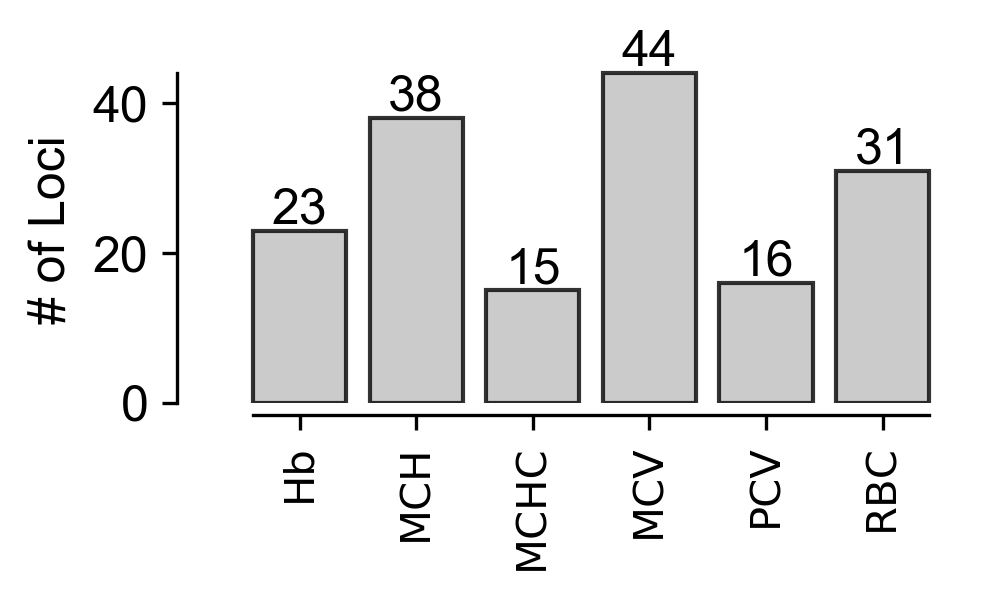


## Size of SNP LD Blocks, distributions (1-S1B)


```python
snpref['dist'] = snpref['blockEnd'].values - snpref['blockStart'].values + 1
```


```python
fig, ax = plt.subplots(1, dpi=300, figsize=(3.4,2))

dists = snpref['dist'].values
dists = np.log10(dists)
xVals = np.linspace(dists.min(), dists.max()+1, 100)
yVals = kdestimate(dists, xVals)

ax.fill_between(xVals, yVals, facecolor='0.75', alpha=0.8)
ax.plot(xVals, yVals, color='black', linewidth=1)

adjust_spines(ax, ['left', 'bottom'])

ax.spines['bottom'].set_position(('outward', 0))
ax.spines['bottom'].set_smart_bounds(True)

ax.spines['left'].set_position(('outward', 0))
ax.spines['left'].set_smart_bounds(True)

ax.set_ylabel('Density')

ax.set_xlabel('log' + r'$_{10}$' + ' LD Block Size (bp)')

for item in ([ax.title, ax.xaxis.label, ax.yaxis.label] +
             ax.get_xticklabels() + ax.get_yticklabels()):
    item.set_fontsize(12)
    item.set_fontname('Arial')

plt.tight_layout(True)

ax.tick_params(
    axis='y',
    which='both',
    left=False,
    right=False,
    labelleft=False)
```

    bandwidth = 0.342652984684


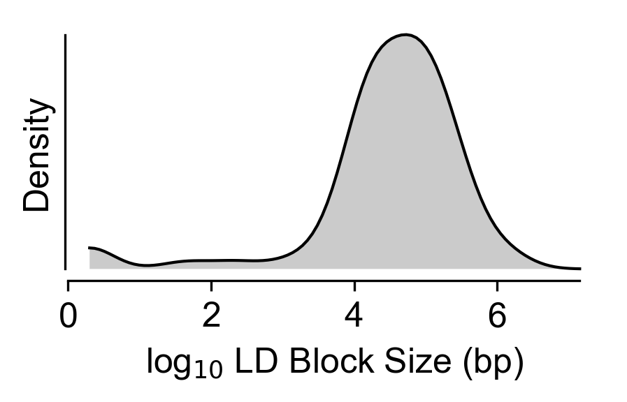


## Genes per Loci (1-S1C)


```python
fig, ax = plt.subplots(1, dpi=300, figsize=(3.4, 2))
genesPerLoci = []

for snp in annoref['snp'].unique():
    genesPerLoci.append(len(annoref[annoref['snp'] == snp]))

genesPerLoci.append(0)

genesPerLoci = np.array(genesPerLoci)

ax.hist(genesPerLoci, bins=30, range=(0,30), width=0.8, fc='0.75', ec='black', alpha=0.8)

adjust_spines(ax, ['left', 'bottom'])

ax.spines['bottom'].set_position(('outward', 0))
ax.spines['bottom'].set_smart_bounds(True)

ax.spines['left'].set_position(('outward', 0))
ax.spines['left'].set_smart_bounds(True)

ax.set_xlabel('# of Genes')
ax.set_ylabel('# of Loci')

for item in ([ax.title, ax.xaxis.label, ax.yaxis.label] +
             ax.get_xticklabels() + ax.get_yticklabels()):
    item.set_fontsize(12)
    item.set_fontname('Arial')

ax.set_xticks([0.4, 5.4, 10.4, 15.4, 20.4, 25.4])
ax.set_xticklabels(['0', '5', '10', '15', '20', '25'])

plt.tight_layout(True)

ax.text(18, 10, 'median = ' + str(int(np.median(genesPerLoci))), fontsize=12, fontname='Arial')
```


    Text(18,10,'median = 4')


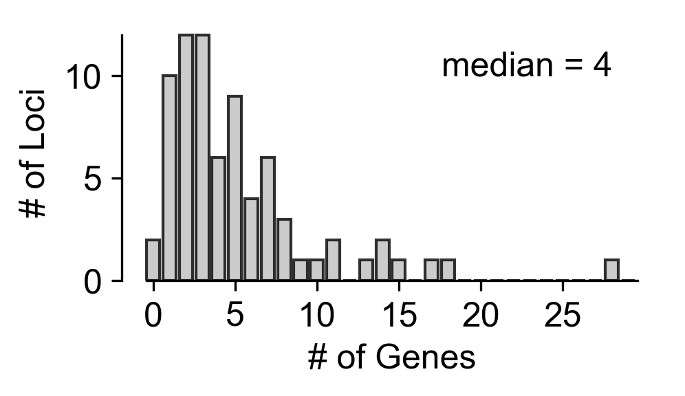


## Number of hairpins per gene (1-S3)


```python
hairpins = []
for gene in annoref[annoref['anno'] == 'gwa']['gene'].values:
    hairpins.append(shref[shref['gene'] == gene].shape[0])
```


```python
fig, ax = plt.subplots(1, dpi=300, figsize=(3.4,2))
    
ax.hist(hairpins, bins=7, range=(2,9), width=0.8, fc='0.75', ec='black', alpha=0.8)

adjust_spines(ax, ['left', 'bottom'])

ax.spines['bottom'].set_position(('outward', 0))
ax.spines['bottom'].set_smart_bounds(True)

ax.spines['left'].set_position(('outward', 0))
ax.spines['left'].set_smart_bounds(True)

ax.set_xlabel('# of Hairpins')
ax.set_ylabel('# of Genes')

for item in ([ax.title, ax.xaxis.label, ax.yaxis.label] +
             ax.get_xticklabels() + ax.get_yticklabels()):
    item.set_fontsize(12)
    #item.set_fontname('Arial')
    item.set_fontname('Arial')

ax.set_xticks([0.4+x for x in range(2,9)])
ax.set_xticklabels([str(x) for x in range(2,9)])

plt.tight_layout(True)
```


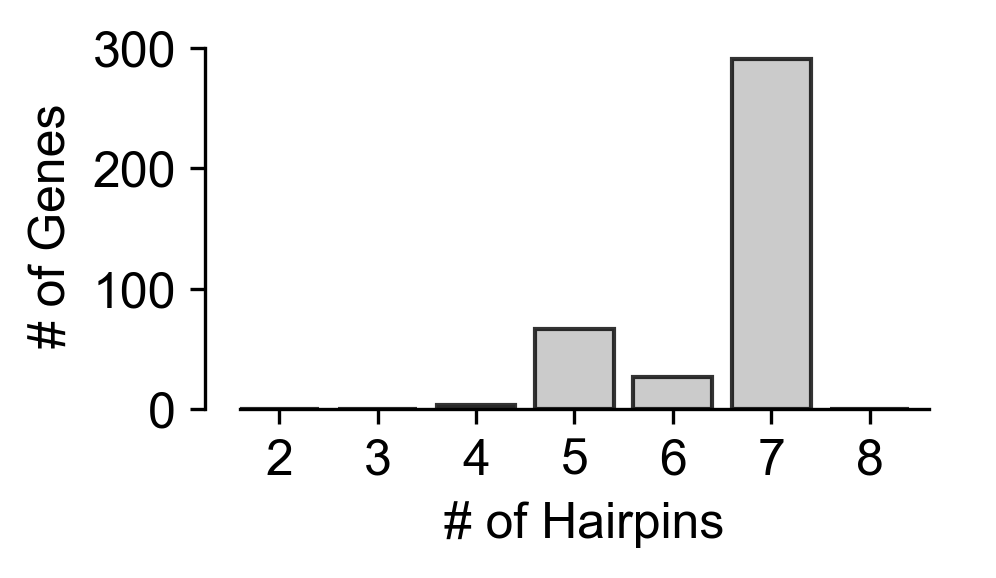


## Log2 fold counts across screen at d0 (2A)


```python
fig, ax = plt.subplots(1, dpi=300, figsize=(3.4, 2))

yRaw = phenoRaw[[x for x in phenoRaw.columns if 'd4' in x]].mean(axis=1).values
xVals = np.linspace(yRaw.min(), yRaw.max(), 100)

yVals = kdestimate(yRaw, xVals)

ax.fill_between(xVals, yVals, facecolor='0.75', alpha=0.8)
ax.plot(xVals, yVals, color='black', linewidth=1)
ax.set_xlim(xVals[0], xVals[-1])

ax.tick_params(
    axis='y',
    which='both',
    left=True,
    right=False,
    labelleft=True)

ax.tick_params(
    axis='x',
    which='both',
    top=False,
    bottom=True,
    labelbottom=True)

ax.spines["top"].set_visible(False)
ax.spines["right"].set_visible(False)

ax.set_ylabel('Probability Density')
ax.set_xlabel('log' + r'$_2$' + ' RNA CPM, Day 4')

adjust_spines(ax, ['bottom', 'left'])

for item in ([ax.title, ax.xaxis.label, ax.yaxis.label] +
             ax.get_xticklabels() + ax.get_yticklabels()):
    item.set_fontsize(12)
    item.set_fontname('Arial')

ax.xaxis.set_tick_params(width=1)
ax.yaxis.set_tick_params(width=1)

for axis in ['bottom','left']:
    ax.spines[axis].set_linewidth(1)
    
plt.tight_layout(True)
```

    bandwidth = 0.183832053199


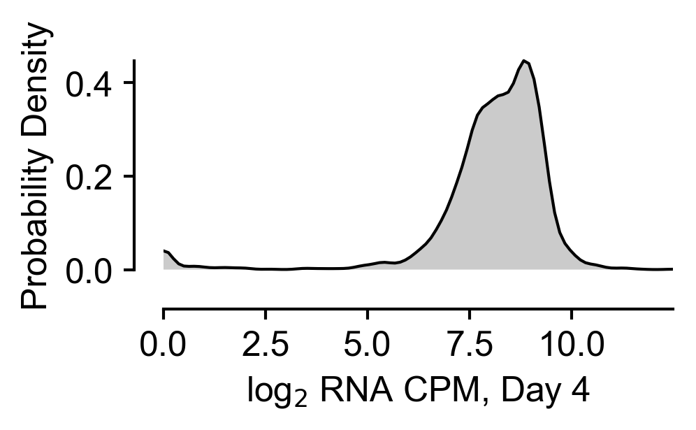


## Fold change plots D4 - DX (2B, 2-S1)


```python
genes = pheno['gene'].unique()
```


```python
phenoMean = []
phenoStd = []

for gene in genes:
    vals = pheno[(pheno['gene'] == gene)][[x for x in pheno.columns if 'd16' in x]].mean().values
    phenoMean.append(vals.mean())
    phenoStd.append(vals.std())

phenoMean = np.array(phenoMean)
phenoStd = np.array(phenoStd)

print(len(genes), phenoMean.shape, phenoStd.shape)
```

    419 (419,) (419,)


```python
sortInds = np.argsort(phenoMean)

phenoMean = phenoMean[sortInds]
phenoStd = phenoStd[sortInds]
genes = np.array(genes)[sortInds]
```


```python
fig, ax = plt.subplots(1, dpi=300, figsize=(3.4,2))

# Plot the means.
#ax.plot(range(len(phenoMean[phenoMean <= 0])), phenoMean[phenoMean <= 0], color='red')
ax.fill_between(range(len(phenoMean[phenoMean <= 0])), phenoMean[phenoMean <= 0], facecolor='0.75', alpha=0.8)
#ax.plot(range(len(phenoMean[phenoMean <= 0]), len(phenoMean[phenoMean <= 0])+len(phenoMean[phenoMean > 0])), phenoMean[phenoMean > 0], color='blue')
ax.fill_between(range(len(phenoMean[phenoMean <= 0]), len(phenoMean[phenoMean <= 0])+len(phenoMean[phenoMean > 0])), phenoMean[phenoMean > 0], facecolor='0.75', alpha=0.8)

# Plot the 2 std's.
ax.fill_between(range(len(phenoMean[phenoMean <= 0])), phenoMean[phenoMean <= 0] - phenoStd[phenoMean <= 0], phenoMean[phenoMean <= 0] + 2*phenoStd[phenoMean <= 0], facecolor='0.5', alpha=0.5)
ax.fill_between(range(len(phenoMean[phenoMean <= 0]), len(phenoMean[phenoMean <= 0])+len(phenoMean[phenoMean > 0])), phenoMean[phenoMean > 0] - phenoStd[phenoMean > 0], phenoMean[phenoMean > 0] + 2*phenoStd[phenoMean > 0], facecolor='0.5', alpha=0.5)

ax.plot(range(len(phenoMean)), phenoMean, color='black', linewidth=1)

ax.axhline(0, color='black', ls='dashed', lw=1)

ax.set_ylabel('D4-D16 log' + r'$_2$' + ' FC')
ax.set_xlabel('Gene')

adjust_spines(ax, ['left'])

for item in ([ax.title, ax.xaxis.label, ax.yaxis.label] +
             ax.get_xticklabels() + ax.get_yticklabels()):
    item.set_fontsize(12)
    item.set_fontname('Arial')

ax.xaxis.set_tick_params(width=1)
ax.yaxis.set_tick_params(width=1)

ax.set_yticks([-10, -7.5, -5.0, -2.5, 0, 2.5])
ax.scatter([0,0], [-10, 2.5], color='white')

for axis in ['bottom','left']:
    ax.spines[axis].set_linewidth(1)
    
plt.tight_layout(True)
```


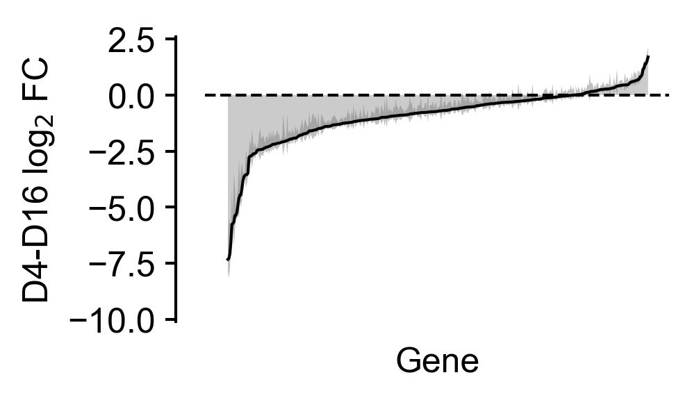


```python
print('RPS19', phenoMean[list(genes).index('RPS19')],
      '\nGATA1', phenoMean[list(genes).index('GATA1')],
      '\nLuc', phenoMean[list(genes).index('promegaLuc')],
      '\nLuc', phenoMean[list(genes).index('promegaLuc.1')],
      '\nLacZ', phenoMean[list(genes).index('lacZ')])
```

    RPS19 -4.44418636163 
    GATA1 -3.63486739223 
    Luc 0.213669955346 
    Luc 0.554316885078 
    LacZ 0.64610625704


```python
ymin, ymax = ax.get_ylim()
```


```python
genes = list(phenoRaw['gene'].unique())

for day in ['d6', 'd9', 'd12', 'd14']:

    phenoMean = []
    phenoStd = []

    for gene in genes:
        vals = pheno[(pheno['gene'] == gene)][[x for x in pheno.columns if day in x]].mean().values
        phenoMean.append(vals.mean())
        phenoStd.append(vals.std())

    phenoMean = np.array(phenoMean)
    phenoStd = np.array(phenoStd)

    sortInds = np.argsort(phenoMean)

    phenoMean = phenoMean[sortInds]
    phenoStd = phenoStd[sortInds]
    genes = np.array(genes)[sortInds]

    fig, ax = plt.subplots(1, dpi=300, figsize=(3.4,2))

    ax.set_ylim([ymin, ymax])
    
    # Plot the means.
    ax.fill_between(range(len(phenoMean[phenoMean <= 0])), phenoMean[phenoMean <= 0], facecolor='0.75', alpha=0.8)
    ax.fill_between(range(len(phenoMean[phenoMean <= 0]), len(phenoMean[phenoMean <= 0])+len(phenoMean[phenoMean > 0])), phenoMean[phenoMean > 0], facecolor='0.75', alpha=0.8)

    # Plot the 2 std's.
    ax.fill_between(range(len(phenoMean[phenoMean <= 0])), phenoMean[phenoMean <= 0] - 2*phenoStd[phenoMean <= 0], phenoMean[phenoMean <= 0] + 2*phenoStd[phenoMean <= 0], facecolor='0.5', alpha=0.5)
    ax.fill_between(range(len(phenoMean[phenoMean <= 0]), len(phenoMean[phenoMean <= 0])+len(phenoMean[phenoMean > 0])), phenoMean[phenoMean > 0] - 2*phenoStd[phenoMean > 0], phenoMean[phenoMean > 0] + 2*phenoStd[phenoMean > 0], facecolor='0.5', alpha=0.5)

    ax.plot(range(len(phenoMean)), phenoMean, color='black', linewidth=1)
    ax.scatter([0,0], [-10, 2.5], color='white')
    
    ax.axhline(0, color='black', ls='dashed', lw=1)

    ax.set_ylabel('D4-D' + day[1:] + ' log' + r'$_2$' + ' FC')
    ax.set_xlabel('Gene')

    ax.set_yticks([-10, -7.5, -5.0, -2.5, 0, 2.5])
    
    adjust_spines(ax, ['left'])

    for item in ([ax.title, ax.xaxis.label, ax.yaxis.label] +
                 ax.get_xticklabels() + ax.get_yticklabels()):
        item.set_fontsize(12)
        item.set_fontname('Arial')

    ax.xaxis.set_tick_params(width=1)
    ax.yaxis.set_tick_params(width=1)

    for axis in ['bottom','left']:
        ax.spines[axis].set_linewidth(1)

    plt.tight_layout(True)
```


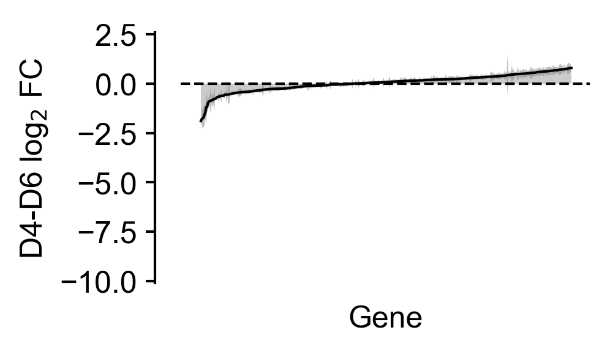


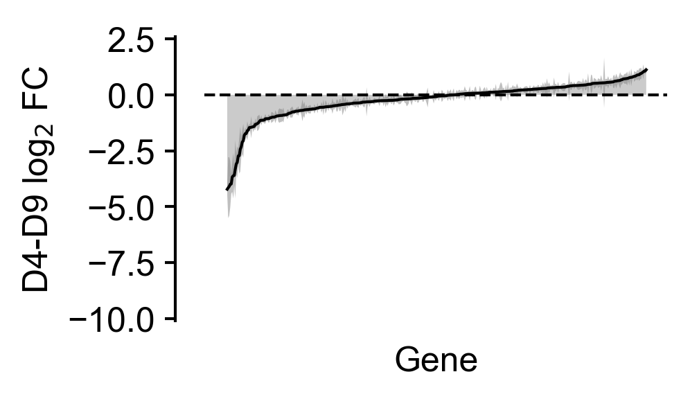


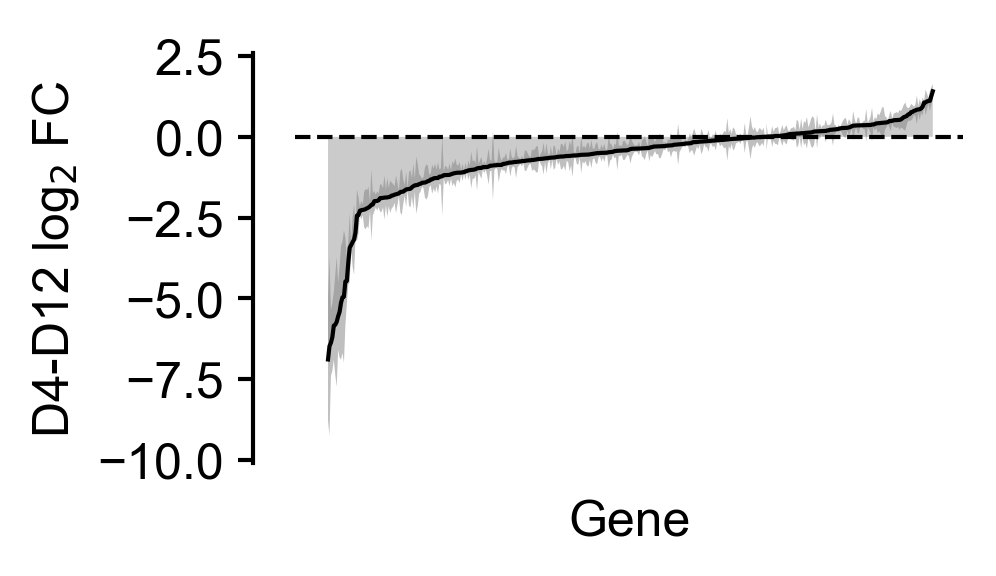


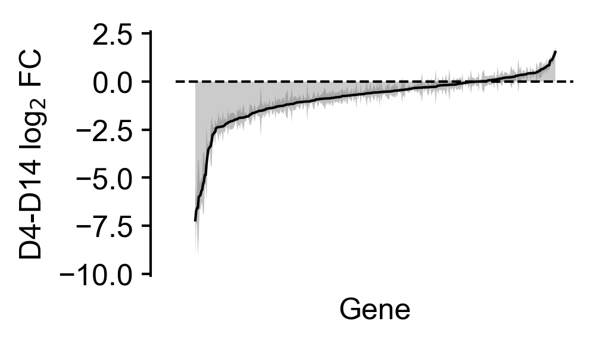


## Replicate Correlation (2-S2)


```python
from scipy.stats import pearsonr
```


```python
phenoRaw.head()
```


<div>
<style scoped>
    .dataframe tbody tr th:only-of-type {
        vertical-align: middle;
    }

    .dataframe tbody tr th {
        vertical-align: top;
    }

    .dataframe thead th {
        text-align: right;
    }
</style>
<table border="1" class="dataframe">
  <thead>
    <tr style="text-align: right;">
      <th></th>
      <th>id</th>
      <th>shrna</th>
      <th>seed</th>
      <th>type</th>
      <th>gene</th>
      <th>chr</th>
      <th>gWindowStart</th>
      <th>gWindowEnd</th>
      <th>snp</th>
      <th>snpPos</th>
      <th>...</th>
      <th>pheno-r2d9</th>
      <th>pheno-r2d12</th>
      <th>pheno-r2d14</th>
      <th>pheno-r2d16</th>
      <th>pheno-r3d4</th>
      <th>pheno-r3d6</th>
      <th>pheno-r3d9</th>
      <th>pheno-r3d12</th>
      <th>pheno-r3d14</th>
      <th>pheno-r3d16</th>
    </tr>
  </thead>
  <tbody>
    <tr>
      <th>0</th>
      <td>sr0001</td>
      <td>GCCAGCACTATACCATTGTT</td>
      <td>AACAATG</td>
      <td>gwa</td>
      <td>ATP2B4</td>
      <td>chr1</td>
      <td>203485914.0</td>
      <td>203753209.0</td>
      <td>rs7551442</td>
      <td>203655121.0</td>
      <td>...</td>
      <td>8.168618</td>
      <td>7.216856</td>
      <td>6.431004</td>
      <td>6.854079</td>
      <td>9.272318</td>
      <td>9.080030</td>
      <td>8.437203</td>
      <td>7.973226</td>
      <td>7.506765</td>
      <td>7.469177</td>
    </tr>
    <tr>
      <th>1</th>
      <td>sr0002</td>
      <td>CCGGACTATCTGCATAGCTT</td>
      <td>AAGCTAT</td>
      <td>gwa</td>
      <td>ATP2B4</td>
      <td>chr1</td>
      <td>203485914.0</td>
      <td>203753209.0</td>
      <td>rs7551442</td>
      <td>203655121.0</td>
      <td>...</td>
      <td>5.696405</td>
      <td>4.695998</td>
      <td>4.356206</td>
      <td>4.794245</td>
      <td>5.269092</td>
      <td>5.935881</td>
      <td>4.659593</td>
      <td>4.457044</td>
      <td>3.846062</td>
      <td>4.992486</td>
    </tr>
    <tr>
      <th>2</th>
      <td>sr0003</td>
      <td>CCTGATTCTATACTTTGTGA</td>
      <td>TCACAAA</td>
      <td>gwa</td>
      <td>ATP2B4</td>
      <td>chr1</td>
      <td>203485914.0</td>
      <td>203753209.0</td>
      <td>rs7551442</td>
      <td>203655121.0</td>
      <td>...</td>
      <td>6.255011</td>
      <td>5.573350</td>
      <td>5.240208</td>
      <td>5.389931</td>
      <td>5.584000</td>
      <td>5.970930</td>
      <td>5.819766</td>
      <td>6.374147</td>
      <td>5.863295</td>
      <td>5.264574</td>
    </tr>
    <tr>
      <th>3</th>
      <td>sr0004</td>
      <td>GCTGAGATTGTGGTTGGTGA</td>
      <td>TCACCAA</td>
      <td>gwa</td>
      <td>ATP2B4</td>
      <td>chr1</td>
      <td>203485914.0</td>
      <td>203753209.0</td>
      <td>rs7551442</td>
      <td>203655121.0</td>
      <td>...</td>
      <td>7.874147</td>
      <td>7.334211</td>
      <td>6.416454</td>
      <td>7.007362</td>
      <td>9.355140</td>
      <td>8.514990</td>
      <td>7.520692</td>
      <td>7.533141</td>
      <td>6.873735</td>
      <td>7.141803</td>
    </tr>
    <tr>
      <th>4</th>
      <td>sr0005</td>
      <td>GATGCACTGACCCAGATTAA</td>
      <td>TTAATCT</td>
      <td>gwa</td>
      <td>ATP2B4</td>
      <td>chr1</td>
      <td>203485914.0</td>
      <td>203753209.0</td>
      <td>rs7551442</td>
      <td>203655121.0</td>
      <td>...</td>
      <td>6.129638</td>
      <td>5.452987</td>
      <td>4.988071</td>
      <td>4.707398</td>
      <td>8.551055</td>
      <td>7.280156</td>
      <td>5.887062</td>
      <td>3.842022</td>
      <td>5.244593</td>
      <td>5.370776</td>
    </tr>
  </tbody>
</table>
<p>5 rows × 28 columns</p>
</div>


```python
pheno1 = phenoRaw[[x for x in phenoRaw.columns if 'r1' in x]].values.flatten()
pheno2 = phenoRaw[[x for x in phenoRaw.columns if 'r2' in x]].values.flatten()
pheno3 = phenoRaw[[x for x in phenoRaw.columns if 'r3' in x]].values.flatten()

pheno1 = phenoRaw[[x for x in phenoRaw.columns if 'r1d4' in x]].values.flatten() - phenoRaw[[x for x in phenoRaw.columns if 'r1d16' in x]].values.flatten()
pheno2 = phenoRaw[[x for x in phenoRaw.columns if 'r2d4' in x]].values.flatten() - phenoRaw[[x for x in phenoRaw.columns if 'r2d16' in x]].values.flatten()
pheno3 = phenoRaw[[x for x in phenoRaw.columns if 'r3d4' in x]].values.flatten() - phenoRaw[[x for x in phenoRaw.columns if 'r3d16' in x]].values.flatten()
```

***Pheno1, Pheno2***


```python
fig, ax = plt.subplots(1, figsize=(3.4,3), dpi=300)

ax.scatter(pheno1, pheno2, color='0.75', alpha=0.5, s=3)

ax.plot([0, 1], [0, 1], transform=ax.transAxes, color='black', ls='dotted')

ax.set_xlabel('Donor Replicate 1 D4-D16 log' r'$_2$' + ' FC')
ax.set_ylabel('Donor Replicate 2 D4-D16 log' r'$_2$' + ' FC')

ax.text(-1.0,12.5,'Pearson r = ' + str(pearsonr(pheno1, pheno2)[0]), size=12, fontname='Arial')

adjust_spines(ax, ['bottom', 'left'])

for item in ([ax.title, ax.xaxis.label, ax.yaxis.label] +
             ax.get_xticklabels() + ax.get_yticklabels()):
    item.set_fontsize(12)
    item.set_fontname('Arial')

ax.xaxis.set_tick_params(width=1)
ax.yaxis.set_tick_params(width=1)

for axis in ['bottom','left']:
    ax.spines[axis].set_linewidth(1)
    
plt.tight_layout(True)
```


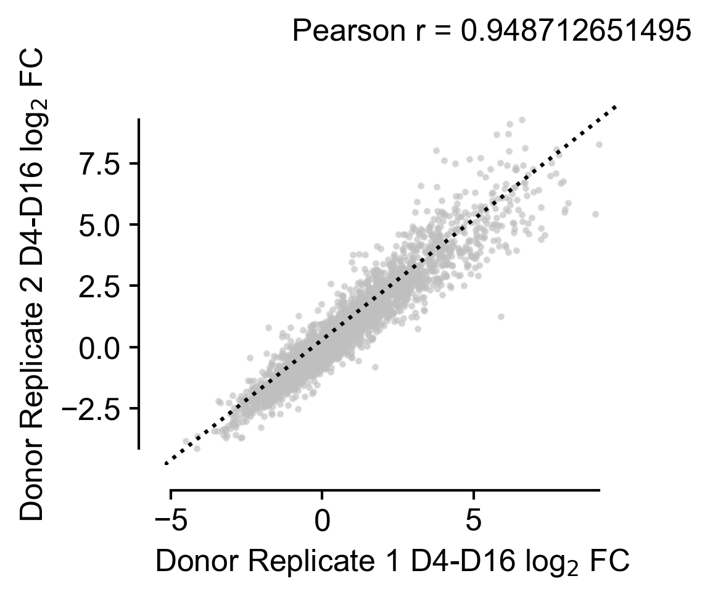


***Pheno1, Pheno3***


```python
fig, ax = plt.subplots(1, figsize=(3.4,3), dpi=300)

ax.scatter(pheno1, pheno3, color='0.75', alpha=0.5, s=3)

ax.plot([0, 1], [0, 1], transform=ax.transAxes, color='black', ls='dotted')

ax.set_xlabel('Donor Replicate 1 D4-D16 log' r'$_2$' + ' FC')
ax.set_ylabel('Donor Replicate 3 D4-D16 log' r'$_2$' + ' FC')

ax.text(-1.0,12.5,'Pearson r = ' + str(pearsonr(pheno1, pheno3)[0]), size=12, fontname='Arial')

adjust_spines(ax, ['bottom', 'left'])

for item in ([ax.title, ax.xaxis.label, ax.yaxis.label] +
             ax.get_xticklabels() + ax.get_yticklabels()):
    item.set_fontsize(12)
    item.set_fontname('Arial')

ax.xaxis.set_tick_params(width=1)
ax.yaxis.set_tick_params(width=1)

for axis in ['bottom','left']:
    ax.spines[axis].set_linewidth(1)
    
plt.tight_layout(True)
```


***Pheno2, Pheno3***


```python
fig, ax = plt.subplots(1, figsize=(3.4,3), dpi=300)

ax.scatter(pheno2, pheno3, color='0.75', alpha=0.5, s=3)

ax.plot([0, 1], [0, 1], transform=ax.transAxes, color='black', ls='dotted')

ax.set_xlabel('Donor Replicate 2 D4-D16 log' r'$_2$' + ' FC')
ax.set_ylabel('Donor Replicate 3 D4-D16 log' r'$_2$' + ' FC')

ax.text(-1.0,12.5,'Pearson r = ' + str(pearsonr(pheno2, pheno3)[0]), size=12, fontname='Arial')

adjust_spines(ax, ['bottom', 'left'])

for item in ([ax.title, ax.xaxis.label, ax.yaxis.label] +
             ax.get_xticklabels() + ax.get_yticklabels()):
    item.set_fontsize(12)
    item.set_fontname('Arial')

ax.xaxis.set_tick_params(width=1)
ax.yaxis.set_tick_params(width=1)

for axis in ['bottom','left']:
    ax.spines[axis].set_linewidth(1)
    
plt.tight_layout(True)
```


## +/- Examples (2D)


```python
chosenGenes = ['GATA1', 'RPS19', 'lacZ', 'promegaLuc', 'RUNDC3A', 'EIF5']
chosenGeneNames = ['GATA1', 'RPS19', 'LacZ', 'Luciferase', 'RUNDC3A', 'EIF5']
```


```python
d4vals = []
for gene in chosenGenes:
    d4vals.append(phenoRaw[phenoRaw['gene'] == gene][[x for x in phenoRaw.columns if 'd4' in x]].values.flatten())
```


```python
d16vals = []
for gene in chosenGenes:
    d16vals.append(phenoRaw[phenoRaw['gene'] == gene][[x for x in phenoRaw.columns if 'd16' in x]].values.flatten())
```

To further customize violin plot, see:
https://matplotlib.org/devdocs/gallery/statistics/customized_violin.html


```python
genesForPlot = 4

import matplotlib.patches as mpatches

fig, ax = plt.subplots(1, dpi=500, figsize=(3.4,2))

d4boxes = ax.violinplot(d4vals[:genesForPlot], positions=np.linspace(0.8, genesForPlot-0.2, genesForPlot), showmeans=False, showmedians=False,
        showextrema=False)
d16boxes = ax.violinplot(d16vals[:genesForPlot], positions=np.linspace(1.2, genesForPlot+0.2, genesForPlot), showmeans=False, showmedians=False,
        showextrema=False)

adjust_spines(ax, ['bottom', 'left'])

ax.set_xticks(range(1,5))
ax.set_xticklabels(['GATA1', 'RPS19', 'LacZ', 'Luc'])

for box in d4boxes['bodies']:
    box.set_facecolor('0.75')
    box.set_edgecolor('black')
    box.set_alpha(0.8)
    
for box in d16boxes['bodies']:
    box.set_facecolor('0.25')
    box.set_edgecolor('black')
    box.set_alpha(0.8)
    
ax.set_ylabel('log' r'$_2$' + ' CPM')

ax.scatter(np.linspace(0.8, genesForPlot-0.2, genesForPlot), [np.median(x) for x in d4vals[:genesForPlot]], color='black')
ax.scatter(np.linspace(1.2, genesForPlot+0.2, genesForPlot), [np.median(x) for x in d16vals[:genesForPlot]], color='black')

b = mpatches.Patch(facecolor='0.75', alpha=0.8, linewidth=1, edgecolor='black')
r = mpatches.Patch(facecolor='0.25', alpha=0.8, linewidth=1, edgecolor='black')


for item in ([ax.title, ax.xaxis.label, ax.yaxis.label] +
             ax.get_xticklabels() + ax.get_yticklabels()):
    item.set_fontsize(12)
    item.set_fontname('Arial')
    
for item in (ax.get_xticklabels()):
    item.set_fontsize(10)
    item.set_fontname('Arial')
    
ax.xaxis.set_tick_params(width=1)
ax.yaxis.set_tick_params(width=1)

for axis in ['bottom','left']:
    ax.spines[axis].set_linewidth(1)

font = mpl.font_manager.FontProperties(family='Arial')
    
ax.legend((b,r), ('D4', 'D16'), ncol=2, bbox_to_anchor=(0.72, 1.1), fontsize=10, prop=font, frameon=False)

plt.tight_layout(True)
```


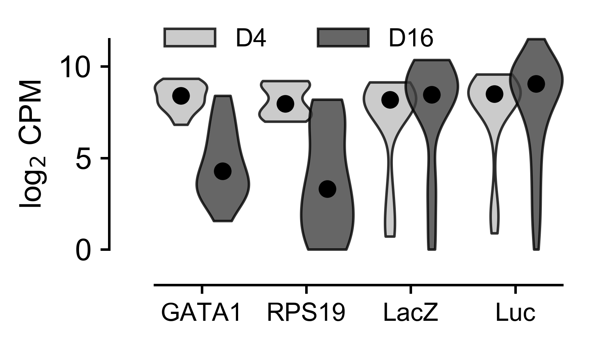


## Log2 FC Comparison by Type (2C, 2E)


```python
types = list(annoref['anno'].unique())
colors = ['green', 'red', 'orange', 'blue']
labels = ['GWAS-nominated', 'Erythroid', 'Essential', '- Control']
print(types)
print(labels)
```

    ['gwa', 'ery', 'ess', 'neg']
    ['GWAS-nominated', 'Erythroid', 'Essential', '- Control']


```python
fcs = []
for typ in types:
    fcs.append((phenoRaw[phenoRaw['type'] == typ][[x for x in phenoRaw.columns if 'd16' in x]].values - \
    phenoRaw[phenoRaw['type'] == typ][[x for x in phenoRaw.columns if 'd4' in x]].values).mean(axis=1))
```


```python
fig, ax = plt.subplots(1, dpi=500, figsize=(3.4,2))

xVals = np.linspace(-10, 5, 100)

for i,typ in enumerate(types):
    fc = fcs[i]
    
    ax.fill_between(xVals, 0-i*0.2, kdestimate(fc, xVals, bandwidth=0.5)-i*0.2, color=colors[i], alpha=0.6, label=labels[i])
    
ax.set_ylabel('Probability Density')
ax.set_xlabel('shRNA D4-D16 log' + r'$_2$' + ' FC')

adjust_spines(ax, ['bottom'])

for item in ([ax.title, ax.xaxis.label, ax.yaxis.label] +
             ax.get_xticklabels() + ax.get_yticklabels()):
    item.set_fontsize(12)
    item.set_fontname('Arial')

ax.xaxis.set_tick_params(width=1)
ax.yaxis.set_tick_params(width=1)

for axis in ['bottom','left']:
    ax.spines[axis].set_linewidth(1)
    
lgd = ax.legend(ncol=2, frameon=False, fontsize=10, loc='upper left', prop=font, bbox_to_anchor=(0.0,1.4))

plt.tight_layout(False)
```


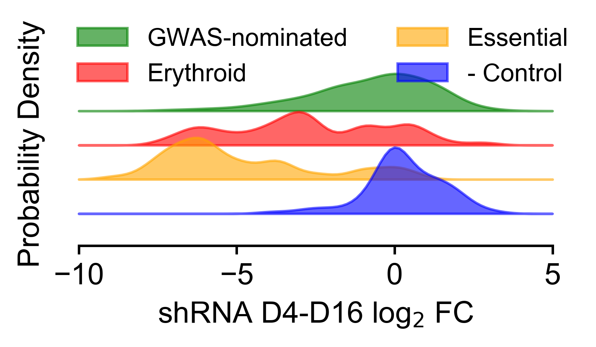


```python
genes = pheno['gene'].unique()

fig, ax = plt.subplots(1, dpi=500, figsize=(6.8,2))

ax.set_ylabel('Mean shRNA log' + r'$_2$' + ' CPM')
ax.set_xlabel('Day')

adjust_spines(ax, ['bottom', 'left'])

for item in ([ax.title, ax.xaxis.label, ax.yaxis.label] +
             ax.get_xticklabels() + ax.get_yticklabels()):
    item.set_fontsize(12)
    item.set_fontname('Arial')

ax.xaxis.set_tick_params(width=1)
ax.yaxis.set_tick_params(width=1)

for axis in ['bottom','left']:
    ax.spines[axis].set_linewidth(1)
    
for gene in genes:
    vals = phenoRaw[phenoRaw['gene'] == gene][[x for x in phenoRaw.columns if 'pheno-r' in x]].values
    vals = vals.reshape(vals.shape[0]*3,6)
    vals = vals.mean(axis=0)
    if vals.mean() != 0:
        if gene in ['GATA1', 'RPS19']:
            ax.plot([4, 6, 9, 12, 14, 16], vals, color='red', linewidth=2, alpha=0.5)
        elif gene in ['lacZ']:
            ax.plot([4, 6, 9, 12, 14, 16], vals, color='blue', linewidth=2, alpha=0.5)
        elif gene in ['promegaLuc']:
            vals = phenoRaw[phenoRaw['gene'].isin(['promegaLuc', 'promegaLuc.1'])][[x for x in phenoRaw.columns if 'pheno-r' in x]].values
            vals = vals.reshape(vals.shape[0]*3,6)
            vals = vals.mean(axis=0)
            ax.plot([4, 6, 9, 12, 14, 16], vals, color='blue', linewidth=2, alpha=0.5)
        elif gene in ['promegaLuc.1']:
            pass
        else:
            ax.plot([4, 6, 9, 12, 14, 16], vals, color='gray', linewidth=1, alpha=0.1)
```


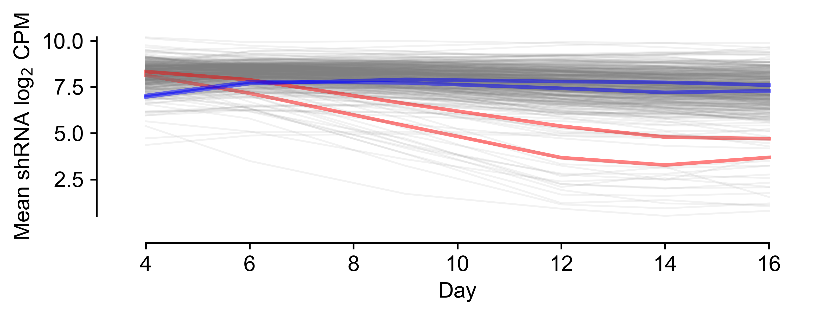


# Linear Mixed Model (LMM)

Implemented in R, script below:
```
library(Matrix)
library(lme4)
library(dplyr)
library(readr)
library(optimx)
library(qvalue)
library(car)
df <- read_csv("ref/rInput/allInput.csv")
df <- as.data.frame(df)
df$day <- as.factor(df$day)

# Need to get rid of genes with < 3 hairpins or all 0 reads for lme to work.
goodGenes <- df %>%
  group_by(geneName) %>%
  summarize(count=n(), Mean=mean(l2Vals)) %>%
  filter(count >= 54, Mean > 0.0) %>%
  .$geneName
  
optimizer <- lmerControl(optimizer ='optimx', optCtrl=list(method='nlminb'))

mm <- df %>%
  filter(geneName %in% goodGenes) %>%
  group_by(geneName) %>%
  do(
      tempMod = lmer(l2Rel4 ~ 1 + totalDur + (0 + totalDur|shrnaName), data=., control=optimizer, REML=FALSE)
    ) %>%
    do(
      gene = .$geneName,
      intercept = .$tempMod@beta[1],
      betaDur = .$tempMod@beta[2],
      pval = Anova(.$tempMod)$Pr[1]
  )

mm$gene = unlist(mm$gene)
mm$intercept = unlist(mm$intercept)
mm$betaDur = unlist(mm$betaDur)
mm$pval = unlist(mm$pval)
mm$qval <- qvalue(mm$pval)$qvalues

write.csv(mm, file='rModelOutput.csv')
```

# LMM Results Analysis

## Hits per SNP (3A)


```python
modeldf = pd.read_csv('ref/rModelOutput.csv')
modeldf.head()
```


<div>
<style scoped>
    .dataframe tbody tr th:only-of-type {
        vertical-align: middle;
    }

    .dataframe tbody tr th {
        vertical-align: top;
    }

    .dataframe thead th {
        text-align: right;
    }
</style>
<table border="1" class="dataframe">
  <thead>
    <tr style="text-align: right;">
      <th></th>
      <th>gene</th>
      <th>intercept</th>
      <th>betaDur</th>
      <th>pval</th>
      <th>qval</th>
      <th>type</th>
      <th>snp</th>
    </tr>
  </thead>
  <tbody>
    <tr>
      <th>0</th>
      <td>ABCF1</td>
      <td>0.352097</td>
      <td>-0.051540</td>
      <td>0.363531</td>
      <td>0.306232</td>
      <td>gwa</td>
      <td>rs2097775</td>
    </tr>
    <tr>
      <th>1</th>
      <td>ABO</td>
      <td>0.349261</td>
      <td>-0.025273</td>
      <td>0.462122</td>
      <td>0.353532</td>
      <td>gwa</td>
      <td>rs579459</td>
    </tr>
    <tr>
      <th>2</th>
      <td>ACAD10</td>
      <td>0.123335</td>
      <td>-0.062494</td>
      <td>0.354127</td>
      <td>0.305168</td>
      <td>gwa</td>
      <td>rs3184504</td>
    </tr>
    <tr>
      <th>3</th>
      <td>ACADS</td>
      <td>0.041335</td>
      <td>-0.086487</td>
      <td>0.109041</td>
      <td>0.150501</td>
      <td>gwa</td>
      <td>rs3829290</td>
    </tr>
    <tr>
      <th>4</th>
      <td>ACD</td>
      <td>0.403892</td>
      <td>0.043773</td>
      <td>0.293867</td>
      <td>0.267592</td>
      <td>gwa</td>
      <td>rs2271294</td>
    </tr>
  </tbody>
</table>
</div>


```python
modeldf[modeldf['gene'].isin(shref[shref['snp'] == 'rs2159213']['gene'].unique())]
```


<div>
<style scoped>
    .dataframe tbody tr th:only-of-type {
        vertical-align: middle;
    }

    .dataframe tbody tr th {
        vertical-align: top;
    }

    .dataframe thead th {
        text-align: right;
    }
</style>
<table border="1" class="dataframe">
  <thead>
    <tr style="text-align: right;">
      <th></th>
      <th>gene</th>
      <th>intercept</th>
      <th>betaDur</th>
      <th>pval</th>
      <th>qval</th>
      <th>type</th>
      <th>snp</th>
    </tr>
  </thead>
  <tbody>
    <tr>
      <th>15</th>
      <td>AMH</td>
      <td>0.032646</td>
      <td>0.068726</td>
      <td>0.237781</td>
      <td>0.238753</td>
      <td>gwa</td>
      <td>rs2159213</td>
    </tr>
    <tr>
      <th>19</th>
      <td>AP3D1</td>
      <td>0.032876</td>
      <td>-0.082098</td>
      <td>0.086974</td>
      <td>0.133986</td>
      <td>gwa</td>
      <td>rs2159213</td>
    </tr>
    <tr>
      <th>99</th>
      <td>DOT1L</td>
      <td>0.120601</td>
      <td>0.061021</td>
      <td>0.073185</td>
      <td>0.122516</td>
      <td>gwa</td>
      <td>rs2159213</td>
    </tr>
    <tr>
      <th>161</th>
      <td>IZUMO4</td>
      <td>0.400836</td>
      <td>-0.052894</td>
      <td>0.297726</td>
      <td>0.269720</td>
      <td>gwa</td>
      <td>rs2159213</td>
    </tr>
    <tr>
      <th>187</th>
      <td>MKNK2</td>
      <td>0.278652</td>
      <td>-0.044889</td>
      <td>0.493044</td>
      <td>0.362397</td>
      <td>gwa</td>
      <td>rs2159213</td>
    </tr>
    <tr>
      <th>189</th>
      <td>MOB3A</td>
      <td>0.012185</td>
      <td>-0.102658</td>
      <td>0.130925</td>
      <td>0.168058</td>
      <td>gwa</td>
      <td>rs2159213</td>
    </tr>
    <tr>
      <th>310</th>
      <td>SF3A2</td>
      <td>0.151142</td>
      <td>-0.236992</td>
      <td>0.000923</td>
      <td>0.005764</td>
      <td>gwa</td>
      <td>rs2159213</td>
    </tr>
  </tbody>
</table>
</div>


```python
snpLookup = annoref.set_index('gene').to_dict()['snp']
```


```python
modeldf['snp'] = [snpLookup[x] for x in modeldf['gene'].values]
```


```python
# Get all the gwa nominated genes that have a q value < 0.1 and beta magnitude > 0.1.
hitsDF = modeldf[(modeldf['qval'] < 0.1) & (abs(modeldf['betaDur'].values) > 0.1) & ([annoref.set_index('gene').to_dict()['anno'][x] == 'gwa' for x in modeldf['gene'].values])].copy()
```


```python
#hitsDF = modeldf[modeldf['isHit0.1'] == True].copy()
print(hitsDF.shape)
```

    (77, 7)


```python
# Get total list of SNPs from hitsDF
snpHits = list(hitsDF['snp'].unique())
snpHits = [x for x in snpHits if type(x) == str]

len(snpHits)
```


    38


```python
geneHits = list(hitsDF['gene'].unique())
len(geneHits)
```


    77


```python
hitCounts = {}

for snp in snpHits:
    count = len(list(hitsDF[hitsDF['snp'] == snp]['gene'].unique()))
    hitCounts[snp] = count
```


```python
# Count hits per snp per day for each SNP.
forPlot = []
forPlotPos = []
forPlotNeg = []

for i,snp in enumerate(snpHits):
    forPlot.append([snp])
    forPlotPos.append([snp])
    forPlotNeg.append([snp])
    forPlot[i].append([x for x in hitsDF['snp'].values].count(snp))
    forPlotPos[i].append([x for x in hitsDF[hitsDF['betaDur'] > 0]['snp'].values].count(snp))
    forPlotNeg[i].append([x for x in hitsDF[hitsDF['betaDur'] < 0]['snp'].values].count(snp))
```


```python
# Sort values in ascending order
forPlot = sorted(forPlot, key = lambda x: (x[1], x[1], np.argmax(np.array(x[1]) > 0)))
```


```python
newPos = []
for x in forPlot:
    for y in forPlotPos:
        if y[0] == x[0]:
            newPos.append(y)
        
newNeg = []
for x in forPlot:
    for y in forPlotNeg:
        if y[0] == x[0]:
            newNeg.append(y)
            
forPlotPos = newPos
forPlotNeg = newNeg
```


```python
# Modified adjust spines for this figure
def adjust_spines(ax, spines):
    for loc, spine in ax.spines.items():
        if loc in spines:
            spine.set_position(('outward', 10))
            spine.set_smart_bounds(True)
        else:
            spine.set_color('none')
        if loc == 'left':
            spine.set_position(('outward', -5))

    if 'left' in spines:
        ax.yaxis.set_ticks_position('left')
    else:
        ax.yaxis.set_ticks([])

    if 'bottom' in spines:
        ax.xaxis.set_ticks_position('bottom')
    else:
        ax.xaxis.set_ticks([])
```


```python
# Plot
fig, ax = plt.subplots(1, figsize=(8,3.4), dpi=300)

width = 0.85

inds = np.arange(0.0, len([x for x in snpHits]))

for i, ind in enumerate(inds):
    if i%2 == 0:
        ax.add_patch(Rectangle((ind-.45, -8), 0.9, 13, facecolor="grey", alpha=0.1))
    else:
        pass

p = ax.bar(inds, [x[1] for x in forPlotPos], width, edgecolor='black', linewidth=0.5, color='blue')

n = ax.bar(inds, [-1 * x[1] for x in forPlotNeg], width, edgecolor='black', linewidth=0.5, color='red')

plt.tick_params(axis='y', which='both', left=True, right=False, labelleft=True, labelsize=10)
plt.tick_params(axis='x', which='both', top=False, bottom=True, labelbottom=True)

ax.set_xlabel('Gene Hits', fontsize=12)
ax.set_ylabel('SNP', fontsize=12)

adjust_spines(ax, ['bottom', 'left'])

ax.spines['left'].set_position(('outward', 5))
ax.spines['left'].set_smart_bounds(True)

ax.spines['bottom'].set_position(('outward', -5))
ax.spines['bottom'].set_smart_bounds(True)

ax.set_xticks(np.arange(0.0, len([x for x in snpHits])))
ax.set_yticks(np.arange(-8, 6))
ax.set_yticklabels(np.arange(-8, 6))
ax.set_xticklabels([x[0] for x in forPlot], rotation=90)

ax.set_xlim(-1, len(forPlotNeg))

ax.axhline(0, xmax=len(forPlotNeg), color='black', linewidth=1)

ax.xaxis.set_tick_params(width=1)
ax.yaxis.set_tick_params(width=1)

for axis in ['bottom','left']:
    ax.spines[axis].set_linewidth(1) 

plt.tight_layout(True)
```


```python
# Reset to previous adjust_spines definition
def adjust_spines(ax, spines):
    for loc, spine in ax.spines.items():
        if loc in spines:
            spine.set_position(('outward', 10))
            spine.set_smart_bounds(True)
        else:
            spine.set_color('none')

    if 'left' in spines:
        ax.yaxis.set_ticks_position('left')
    else:
        ax.yaxis.set_ticks([])

    if 'bottom' in spines:
        ax.xaxis.set_ticks_position('bottom')
    else:
        ax.xaxis.set_ticks([])
```

## Hits per Locus Histogram (3-S1A)


```python
# Per locus histogram
fig, ax = plt.subplots(1, dpi=300, figsize=(2.4, 2))
genesPerLoci = []

for snp in annoref['snp'].unique():
    genesPerLoci.append(len(annoref[annoref['snp'] == snp]['gene'].unique()))

genesPerLoci.append(0)

genesPerLoci = np.array(genesPerLoci)

ax.hist([0]*37 + [x[1] for x in forPlot], bins=11, range=(0,10), width=0.8, fc='0.75', ec='black', alpha=0.8)

adjust_spines(ax, ['left', 'bottom'])

ax.spines['bottom'].set_position(('outward', 0))
ax.spines['bottom'].set_smart_bounds(True)

ax.spines['left'].set_position(('outward', 0))
ax.spines['left'].set_smart_bounds(True)

ax.set_xlabel('# of Gene Hits')
ax.set_ylabel('# of Loci')

for item in ([ax.title, ax.xaxis.label, ax.yaxis.label] +
             ax.get_xticklabels() + ax.get_yticklabels()):
    item.set_fontsize(12)
    item.set_fontname('Arial')

ax.set_xticks([x + 0.4 - 0.09*i for i,x in enumerate(range(0,11))])
ax.set_xticklabels([str(x) for x in range(0,11)])

plt.tight_layout(True)

ax.text(7, 7.5, 'median = ' + str(int(np.median([sum(x[1:]) for x in forPlot]))), fontsize=12, fontname='Arial')
```


    Text(7,7.5,'median = 1')


## Correlation of beta value and original GWAS effect size


```python
vdh = pd.read_csv('ref/vanderharst2012.tsv', sep='\t')
print(vdh.shape)
vdh.head()
```

    (75, 7)


<div>
<style scoped>
    .dataframe tbody tr th:only-of-type {
        vertical-align: middle;
    }

    .dataframe tbody tr th {
        vertical-align: top;
    }

    .dataframe thead th {
        text-align: right;
    }
</style>
<table border="1" class="dataframe">
  <thead>
    <tr style="text-align: right;">
      <th></th>
      <th>Sentinel SNP</th>
      <th>Position (B36)</th>
      <th>Alleles (EA/OA)</th>
      <th>EAF</th>
      <th>Phenotype</th>
      <th>Effect (SE)</th>
      <th>P</th>
    </tr>
  </thead>
  <tbody>
    <tr>
      <th>0</th>
      <td>rs1175550</td>
      <td>3681388</td>
      <td>G/A</td>
      <td>0.22</td>
      <td>MCHC</td>
      <td>0.008 (0.013)</td>
      <td>8.6 × 10−15</td>
    </tr>
    <tr>
      <th>1</th>
      <td>rs3916164</td>
      <td>39842526</td>
      <td>G/A</td>
      <td>0.71</td>
      <td>MCH</td>
      <td>0.008 (0.004)</td>
      <td>3.1 × 10−10</td>
    </tr>
    <tr>
      <th>2</th>
      <td>rs741959</td>
      <td>47448820</td>
      <td>G/A</td>
      <td>0.57</td>
      <td>MCV</td>
      <td>0.157 (0.025)</td>
      <td>6.0 × 10−10</td>
    </tr>
    <tr>
      <th>3</th>
      <td>rs857684</td>
      <td>156842353</td>
      <td>C/T</td>
      <td>0.74</td>
      <td>MCHC</td>
      <td>−0.006 (0.011)</td>
      <td>3.5 × 10−16</td>
    </tr>
    <tr>
      <th>4</th>
      <td>rs7529925</td>
      <td>197273831</td>
      <td>C/T</td>
      <td>0.28</td>
      <td>RBC</td>
      <td>0.014 (0.002)</td>
      <td>8.3 × 10−9</td>
    </tr>
  </tbody>
</table>
</div>


```python
'−0.014'.find('−')
```


    0


```python
betaLookup = modeldf.set_index('gene').to_dict()['betaDur']
vdhLookup = vdh.set_index('Sentinel SNP').to_dict()['Effect (SE)']
genesCol = sorted(geneHits)
snpsCol = [snpLookup[x] for x in genesCol]
betasCol = [betaLookup[x] for x in genesCol]
vdhsCol = [vdhLookup[x] for x in snpsCol]
vdhsCol = [float(x[:x.index(' ')].replace('−', '-')) for x in vdhsCol]
vdhsAbsCol = [abs(x) for x in vdhsCol]

pearsonr(betasCol, vdhsCol)
```


    (0.015873504739020015, 0.89101516613102416)


## Inter-target Hairpin Correlation (3-S1C)


```python
from scipy.stats import spearmanr
```


```python
tempHits = phenoRaw[phenoRaw['gene'].isin(geneHits)][['id', 'gene'] + [x for x in phenoRaw.columns if 'pheno-' in x]].copy()
tempNots = phenoRaw[~phenoRaw['gene'].isin(geneHits)][['id', 'gene'] + [x for x in phenoRaw.columns if 'pheno-' in x]].copy()

for day in ['d4', 'd6', 'd9', 'd12', 'd14', 'd16']:
    tempHits[day] = tempHits[[x for x in tempHits.columns if day in x]].mean(axis=1)
    for rep in ['r1', 'r2', 'r3']:
        del(tempHits['pheno-' + rep + day])
        
for day in ['d4', 'd6', 'd9', 'd12', 'd14', 'd16']:
    tempNots[day] = tempNots[[x for x in tempNots.columns if day in x]].mean(axis=1)
    for rep in ['r1', 'r2', 'r3']:
        del(tempNots['pheno-' + rep + day])
        
tempHits['mean'] = tempHits[tempHits.columns[2:]].mean(axis=1)
tempNots['mean'] = tempNots[tempNots.columns[2:]].mean(axis=1)
tempHits = tempHits[tempHits['mean'] > 0]
tempNots = tempNots[tempNots['mean'] > 0]

del(tempHits['mean'])
del(tempNots['mean'])
        
hitCorrs = []
notCorrs = []

for gene in phenoRaw['gene'].values:
    if gene in tempHits['gene'].values:
        subdf = tempHits[tempHits['gene'] == gene].copy()
        for i,sid1 in enumerate(subdf['id'].values):
            for sid2 in subdf['id'].values[i+1:]:
                if sid1 == sid2:
                    pass
                else:
                    hitCorrs.append(pearsonr(subdf[subdf['id'] == sid1][subdf.columns[2:]].values[0],
                                   subdf[subdf['id'] == sid2][[x for x in subdf.columns[2:]]].values[0])[0])   
    else:
        subdf = tempNots[tempNots['gene'] == gene].copy()
        for i,sid1 in enumerate(subdf['id'].values):
            for sid2 in subdf['id'].values[i+1:]:
                if sid1 == sid2:
                    pass
                else:
                    notCorrs.append(pearsonr(subdf[subdf['id'] == sid1][[x for x in subdf.columns[2:]]].values[0],
                                   subdf[subdf['id'] == sid2][ subdf.columns[2:]].values[0])[0])  
```


```python
fig, ax = plt.subplots(1, dpi=500, figsize=(2.4,2))

plotdf = pd.DataFrame()
plotdf['plotCol'] = hitCorrs

ax.hist(plotdf['plotCol'].values, label='Among Hits', alpha=0.4, bins=20, density=True)

plotdf = pd.DataFrame()
plotdf['plotCol'] = notCorrs

ax.hist(plotdf['plotCol'].values, label='Among non-hits', alpha=0.4, bins=20, density=True)

#ax.set_ylabel('Probability Density')
ax.set_xlabel('shRNA Pearson Correlation')

adjust_spines(ax, ['bottom'])

for item in ([ax.title, ax.xaxis.label, ax.yaxis.label] +
             ax.get_xticklabels() + ax.get_yticklabels()):
    item.set_fontsize(12)
    item.set_fontname('Arial')

ax.xaxis.set_tick_params(width=1)
ax.yaxis.set_tick_params(width=1)

for axis in ['bottom','left']:
    ax.spines[axis].set_linewidth(1)
    
lgd = ax.legend(ncol=1, frameon=False, fontsize=10, loc='upper left', prop=font, bbox_to_anchor=(0.0,1.4))

plt.tight_layout(False)
```


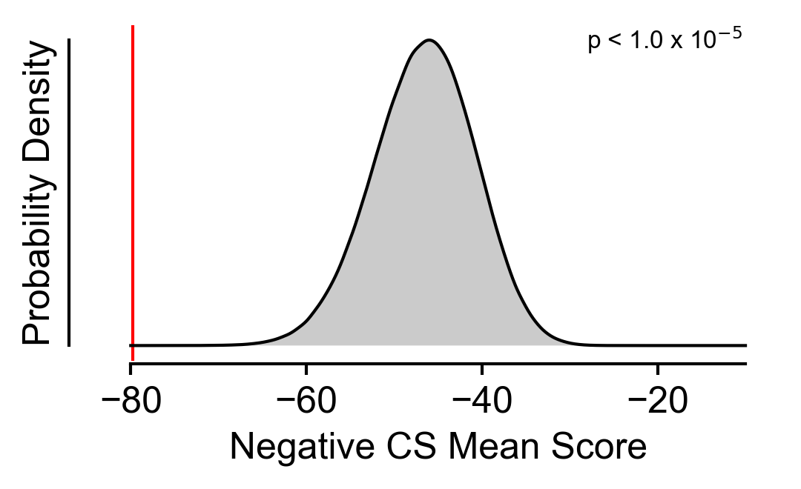


## Essentiality enrichment (3B, 3-S2A-D)


```python
ess = pd.read_csv('ref/Wang2015_TableS3_CRISPRScores.txt', sep='\t')
ess = ess[['Gene', 'sgRNAs included'] + [x for x in ess.columns if 'K562' in x]]
print(ess.shape)
ess.head()
```

    (18166, 4)


<div>
<style scoped>
    .dataframe tbody tr th:only-of-type {
        vertical-align: middle;
    }

    .dataframe tbody tr th {
        vertical-align: top;
    }

    .dataframe thead th {
        text-align: right;
    }
</style>
<table border="1" class="dataframe">
  <thead>
    <tr style="text-align: right;">
      <th></th>
      <th>Gene</th>
      <th>sgRNAs included</th>
      <th>K562 CS</th>
      <th>K562 adjusted p-value</th>
    </tr>
  </thead>
  <tbody>
    <tr>
      <th>0</th>
      <td>A1BG</td>
      <td>9</td>
      <td>-0.220</td>
      <td>0.951988</td>
    </tr>
    <tr>
      <th>1</th>
      <td>A1CF</td>
      <td>7</td>
      <td>-0.984</td>
      <td>0.100374</td>
    </tr>
    <tr>
      <th>2</th>
      <td>A2M</td>
      <td>10</td>
      <td>-0.520</td>
      <td>0.837712</td>
    </tr>
    <tr>
      <th>3</th>
      <td>A2ML1</td>
      <td>10</td>
      <td>-0.646</td>
      <td>0.579034</td>
    </tr>
    <tr>
      <th>4</th>
      <td>A4GALT</td>
      <td>10</td>
      <td>-0.582</td>
      <td>0.695675</td>
    </tr>
  </tbody>
</table>
</div>


```python
trueHits = geneHits.copy()
```


```python
LENmod = 1.0
cutoffMod = 1.5
```


```python
hitEss = {}
for key in trueHits:
    hitEss[key] = []
    try:
        hitEss[key].append(ess[ess['Gene'] == key]['K562 CS'].values[0])
    except:
        pass
            
for key in hitEss.keys():
    hitEss[key] = np.array([x for x in hitEss[key] if x < 0])
    hitEss[key] = np.array(sorted(hitEss[key]))

print(len(hitEss))

delKeys = []
for key in hitEss.keys():
    if len(hitEss[key]) < 1:
        delKeys.append(key)
        
for key in delKeys:
    del(hitEss[key])
        
maxHits = len(hitEss)
        
print(len(hitEss))
```

    77
    67


```python
otherLists = [x for x in glob('ref/otherGWASGenes/*')]
```


```python
# Plotting the negative CS mean score densities hits vs. library
fig, ax = plt.subplots(1, figsize=(3.4,2),dpi=300)

PERMS = 1000000
bw = 0.5

essNeg = ess[ess['K562 CS'] < 0]

ourMeans = []

LEN = int(len(hitEss)*LENmod)
bench = sum([x[0] for x in hitEss.values()])

screenEss = essNeg[essNeg['Gene'].isin(shref[shref['type'] == 'gwa']['gene'].values)]

screenPerm = []
for j in range(PERMS):
    subperm = np.sort(np.random.choice(screenEss['K562 CS'], size=LEN, replace=False))
    screenPerm.append(subperm.sum())

screenPerm = np.array(screenPerm)
ourMeans.append(screenPerm.mean())

xMin = -100
xMax = -10

xVals = np.linspace(xMin, xMax, 1000)
yVals = kdestimate(screenPerm, xVals, bandwidth=1)

adjust_spines(ax, ['bottom', 'left'])
screen = ax.fill_between(xVals, yVals, facecolor='0.75', alpha=0.6, label='Screen')
ax.plot(xVals, yVals, color='black', linewidth=1)

ax.spines['bottom'].set_position(('outward', 1))
ax.spines['bottom'].set_smart_bounds(True)

ax.tick_params(
axis='y',
which='both',
left=False,
right=False,
labelleft=False)

ax.set_ylabel('Probability Density')

ax.axvline(bench, lw=1, color='red')

ax.set_xlabel('Negative CS Mean Score')

for item in ([ax.title, ax.xaxis.label, ax.yaxis.label] +
             ax.get_xticklabels() + ax.get_yticklabels()):
    item.set_fontsize(12)
    item.set_fontname('Arial')

ax.xaxis.set_tick_params(width=1)
ax.yaxis.set_tick_params(width=1)

for axis in ['bottom','left']:
    ax.spines[axis].set_linewidth(1)

ax.text(0.95, 1.0, 'p = ' + str(len(screenPerm[screenPerm < bench])/PERMS), fontname='Arial', fontsize=8, verticalalignment='top', horizontalalignment='right', transform=ax.transAxes)

plt.tight_layout(False)
```


```python
# Plotting the negative CS mean score densities hits vs. genome
fig, ax = plt.subplots(1, figsize=(3.4,2),dpi=300)

PERMS = 1000000
bw = 0.5

essNeg = ess[ess['K562 CS'] < 0]

ourMeans = []

LEN = int(len(hitEss)*LENmod)
bench = sum([x[0] for x in hitEss.values()])

perm = []
for j in range(PERMS):
    subperm = np.sort(np.random.choice(essNeg['K562 CS'], size=LEN, replace=False))
    perm.append(subperm.sum())

perm = np.array(perm)

xMin = -80
xMax = -10


xVals = np.linspace(xMin, xMax, 1000)
yVals = kdestimate(perm, xVals, bandwidth=1)

adjust_spines(ax, ['bottom', 'left'])
genome = ax.fill_between(xVals, yVals, facecolor='0.75', alpha=0.6, label='Genome')
ax.plot(xVals, yVals, color='black', linewidth=1)

ax.spines['bottom'].set_position(('outward', 1))
ax.spines['bottom'].set_smart_bounds(True)

ax.tick_params(
axis='y',
which='both',
left=False,
right=False,
labelleft=False)

ax.set_ylabel('Probability Density')

ax.axvline(bench, lw=1, color='red')

ax.set_xlabel('Negative CS Mean Score')

for item in ([ax.title, ax.xaxis.label, ax.yaxis.label] +
             ax.get_xticklabels() + ax.get_yticklabels()):
    item.set_fontsize(12)
    item.set_fontname('Arial')

ax.xaxis.set_tick_params(width=1)
ax.yaxis.set_tick_params(width=1)

for axis in ['bottom','left']:
    ax.spines[axis].set_linewidth(1)

ax.text(0.95, 1.0, 'p = ' + formatx10(len(perm[perm < bench])/PERMS), fontname='Arial', fontsize=8, verticalalignment='top', horizontalalignment='right', transform=ax.transAxes)

plt.tight_layout(False)
```


```python
# Plotting the negative CS mean score densities hits vs. Triglycerides
fig, ax = plt.subplots(1, figsize=(3.4,2),dpi=300)

PERMS = 1000000
bw = 0.5

essNeg = ess[ess['K562 CS'] < 0]

ourMeans = []

LEN = int(len(hitEss)*LENmod)
bench = sum([x[0] for x in hitEss.values()])

xMin = -80
xMax = -10

xVals = np.linspace(xMin, xMax, 1000)

adjust_spines(ax, ['bottom', 'left'])

ax.spines['bottom'].set_position(('outward', 1))
ax.spines['bottom'].set_smart_bounds(True)

ax.tick_params(
axis='y',
which='both',
left=False,
right=False,
labelleft=False)

ax.set_ylabel('Probability Density')

ax.axvline(bench, lw=1, color='red')

ax.set_xlabel('Negative CS Mean Score')

for item in ([ax.title, ax.xaxis.label, ax.yaxis.label] +
             ax.get_xticklabels() + ax.get_yticklabels()):
    item.set_fontsize(12)
    item.set_fontname('Arial')

ax.xaxis.set_tick_params(width=1)
ax.yaxis.set_tick_params(width=1)

for axis in ['bottom','left']:
    ax.spines[axis].set_linewidth(1)

# Set to True to include the otherGwas
if True:  
    otherList = otherLists[0]
    otherdf = pd.read_csv(otherList)
    otherEss = essNeg[essNeg['Gene'].isin(otherdf['gene'].values)]

    greaterDays = []

    LEN = int(len(hitEss)*LENmod)
    otherPerm = []
    for j in range(PERMS):
        subperm = np.sort(np.random.choice(otherEss['K562 CS'], size=LEN, replace=False))
        otherPerm.append(subperm.sum())

    otherPerm = np.array(otherPerm)

    yVals = kdestimate(otherPerm, xVals, bandwidth=bw)
    ax.fill_between(xVals, yVals, facecolor='0.75', alpha=0.8)
    ax.plot(xVals, yVals, color='black', linewidth=1)

if len(otherPerm[otherPerm < bench]) == 0:
    ax.text(0.95, 1.0, 'p < 1.0 x 10' + r'$^{-5}$', fontsize=8, fontname='Arial', verticalalignment='top', horizontalalignment='right', transform=ax.transAxes)
else:
    ax.text(0.95, 1.0, 'p = ' + formatx10(len(otherPerm[otherPerm < bench])/PERMS), fontname='Arial', fontsize=8, verticalalignment='top', horizontalalignment='right', transform=ax.transAxes)

plt.tight_layout(False)
```


```python
# Plotting the negative CS mean score densities hits vs. LDL
fig, ax = plt.subplots(1, figsize=(3.4,2),dpi=300)

PERMS = 1000000
bw = 0.5

essNeg = ess[ess['K562 CS'] < 0]

ourMeans = []

LEN = int(len(hitEss)*LENmod)
bench = sum([x[0] for x in hitEss.values()])

xMin = -80
xMax = -10

xVals = np.linspace(xMin, xMax, 1000)

adjust_spines(ax, ['bottom', 'left'])

ax.spines['bottom'].set_position(('outward', 1))
ax.spines['bottom'].set_smart_bounds(True)

ax.tick_params(
axis='y',
which='both',
left=False,
right=False,
labelleft=False)

ax.set_ylabel('Probability Density')

ax.axvline(bench, lw=1, color='red')

ax.set_xlabel('Negative CS Mean Score')

for item in ([ax.title, ax.xaxis.label, ax.yaxis.label] +
             ax.get_xticklabels() + ax.get_yticklabels()):
    item.set_fontsize(12)
    item.set_fontname('Arial')

ax.xaxis.set_tick_params(width=1)
ax.yaxis.set_tick_params(width=1)

for axis in ['bottom','left']:
    ax.spines[axis].set_linewidth(1)

# Set to True to include the otherGwas
if True:  
    otherList = otherLists[1]
    otherdf = pd.read_csv(otherList)
    otherEss = essNeg[essNeg['Gene'].isin(otherdf['gene'].values)]

    greaterDays = []

    LEN = int(len(hitEss)*LENmod)
    otherPerm = []
    for j in range(PERMS):
        subperm = np.sort(np.random.choice(otherEss['K562 CS'], size=LEN, replace=False))
        otherPerm.append(subperm.sum())

    otherPerm = np.array(otherPerm)

    yVals = kdestimate(otherPerm, xVals, bandwidth=bw)
    ax.fill_between(xVals, yVals, facecolor='0.75', alpha=0.8)
    ax.plot(xVals, yVals, color='black', linewidth=1)

if len(otherPerm[otherPerm < bench]) == 0:
    ax.text(0.95, 1.0, 'p < 1.0 x 10' + r'$^{-5}$', fontname='Arial', fontsize=8, verticalalignment='top', horizontalalignment='right', transform=ax.transAxes)
else:
    ax.text(0.95, 1.0, 'p = ' + formatx10(len(otherPerm[otherPerm < bench])/PERMS), fontname='Arial', fontsize=8, verticalalignment='top', horizontalalignment='right', transform=ax.transAxes)

plt.tight_layout(False)
```


```python
# Plotting the negative CS mean score densities hits vs. HDL
fig, ax = plt.subplots(1, figsize=(3.4,2),dpi=300)

PERMS = 1000000
bw = 0.5

essNeg = ess[ess['K562 CS'] < 0]

ourMeans = []

LEN = int(len(hitEss)*LENmod)
bench = sum([x[0] for x in hitEss.values()])

xMin = -80
xMax = -10

xVals = np.linspace(xMin, xMax, 1000)

adjust_spines(ax, ['bottom', 'left'])

ax.spines['bottom'].set_position(('outward', 1))
ax.spines['bottom'].set_smart_bounds(True)

ax.tick_params(
axis='y',
which='both',
left=False,
right=False,
labelleft=False)

ax.set_ylabel('Probability Density')

ax.axvline(bench, lw=1, color='red')

ax.set_xlabel('Negative CS Mean Score')

for item in ([ax.title, ax.xaxis.label, ax.yaxis.label] +
             ax.get_xticklabels() + ax.get_yticklabels()):
    item.set_fontsize(12)
    item.set_fontname('Arial')

ax.xaxis.set_tick_params(width=1)
ax.yaxis.set_tick_params(width=1)

for axis in ['bottom','left']:
    ax.spines[axis].set_linewidth(1)

# Set to True to include the otherGwas
if True:  
    otherList = otherLists[2]
    otherdf = pd.read_csv(otherList)
    otherEss = essNeg[essNeg['Gene'].isin(otherdf['gene'].values)]

    greaterDays = []

    LEN = int(len(hitEss)*LENmod)
    otherPerm = []
    for j in range(PERMS):
        subperm = np.sort(np.random.choice(otherEss['K562 CS'], size=LEN, replace=False))
        otherPerm.append(subperm.sum())

    otherPerm = np.array(otherPerm)

    yVals = kdestimate(otherPerm, xVals, bandwidth=bw)
    ax.fill_between(xVals, yVals, facecolor='0.75', alpha=0.8)
    ax.plot(xVals, yVals, color='black', linewidth=1)

if len(otherPerm[otherPerm < bench]) == 0:
    ax.text(0.95, 1.0, 'p < 1.0 x 10' + r'$^5$', fontname='Arial', fontsize=8, verticalalignment='top', horizontalalignment='right', transform=ax.transAxes)
else:
    ax.text(0.95, 1.0, 'p = ' + formatx10(len(otherPerm[otherPerm < bench])/PERMS), fontname='Arial', fontsize=8, verticalalignment='top', horizontalalignment='right', transform=ax.transAxes)

plt.tight_layout(False)
```


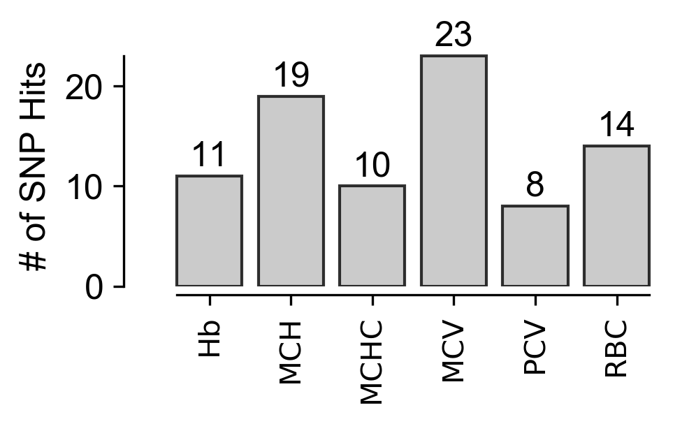


## Gold Standard Rank Sum Permutation (3C)


```python
golds = ['CCND3', 'SH2B3', 'MYB', 'KIT', 'RBM38']
```


```python
from random import sample
from scipy.stats import rankdata

temp = modeldf.copy()
temp['qRank'] = rankdata(temp['qval'].values)
bench = temp[temp['gene'].isin(golds)]['qRank'].sum()
print('bench', bench)

ranks = list(temp['qRank'].values)

numReps = 1000000
perms = []
for rep in range(10000):
    perms.append(sum(sample(ranks, 5)))
    
perms = np.array(perms)
print(sum(perms <= bench)/10000)
```

    bench 520.5
    0.028


```python
###### Plotting the gold standard permutation
fig, ax = plt.subplots(1, figsize=(3.4,2),dpi=300)

xMin = 50
xMax = 2120

xVals = np.linspace(xMin, xMax, 1000)
yVals = kdestimate(perms, xVals, bandwidth=50)

adjust_spines(ax, ['bottom', 'left'])
perm = ax.fill_between(xVals, yVals, facecolor='0.75', alpha=0.8, label='Permuted Rank Sums')
ax.plot(xVals, yVals, color='black', linewidth=1)

ax.spines['bottom'].set_position(('outward', 1))
ax.spines['bottom'].set_smart_bounds(True)

ax.tick_params(
axis='y',
which='both',
left=False,
right=False,
labelleft=False)

ax.set_ylabel('Probability Density')

ax.axvline(bench, lw=1, color='red')

ax.set_xlabel('Functionally Validated Gene Rank Sum')

for item in ([ax.title, ax.xaxis.label, ax.yaxis.label] +
             ax.get_xticklabels() + ax.get_yticklabels()):
    item.set_fontsize(12)
    item.set_fontname('Arial')

ax.xaxis.set_tick_params(width=1)
ax.yaxis.set_tick_params(width=1)

for axis in ['bottom','left']:
    ax.spines[axis].set_linewidth(1)

ax.text(0.95, 1.0, 'p = ' + str(sum(perms <= bench)/10000), fontname='Arial', fontsize=8, verticalalignment='top', horizontalalignment='right', transform=ax.transAxes)

plt.tight_layout(False)
```


## Hits per Trait (3-S1B)


```python
snpTraits = {}
for snp in traitref['SNP'].unique():
    snpTraits[snp] = list(traitref[traitref['SNP'] == snp]['Pheno'].unique())
```


```python
traitCounts = {}
for trait in traitref['Pheno'].unique():
    traitCounts[trait] = 0
        
traitCounts
```


    {'MCHC': 0, 'MCV': 0, 'RBC': 0, 'MCH': 0, 'Hb': 0, 'PCV': 0}


```python
for snp in [x[0] for x in forPlot]:
    traitref = snpTraits[snp]
    for trait in traitref:
        traitCounts[trait] += 1
```


```python
# Plotting snp hits per trait
fig, ax = plt.subplots(1, figsize=(2.4,2),dpi=300)

adjust_spines(ax, ['bottom', 'left'])

traitVals = [traitCounts[x] for x in traits]

ax.bar(range(len(traitVals)), traitVals, fc='0.75', ec='black', alpha=0.8)
    
ax.set_xticks(range(len(traitVals)))
ax.set_xticklabels(traits, rotation=90)

ax.set_ylabel('# of SNP Hits', fontsize=12)

for item in ([ax.title, ax.xaxis.label, ax.yaxis.label] +
             ax.get_xticklabels() + ax.get_yticklabels()):
    item.set_fontsize(12)
    item.set_fontname('Arial')

for x in range(len(traitVals)):
    ax.text(x, traitVals[x]+1, traitVals[x], fontname='Arial', fontsize=12, ha='center')

ax.spines['bottom'].set_position(('outward', 3))
    
ax.set_xticklabels(traits, rotation=90)
    
plt.tight_layout(True)
```


# Cell Type Expression Enrichment Heat Map (3E, 3-S3)


```python
trueHits = geneHits.copy()
print(len(trueHits))
```

    77


```python
erydf = pd.read_csv('ref/expressionData/16populations_RNAcounts.tsv', sep='\t')
erydf = erydf.rename(columns={'Genes':'gene'})
for col in erydf.columns[1:]:
    erydf[col] = np.log2((erydf[col].values+1) / erydf[col].sum() * 1e6)
    
tempCPM = zscore(erydf[[x for x in erydf.columns[1:]]].values, axis=1)

for i,col in enumerate(erydf.columns[1:]):
    erydf[col] = tempCPM[:,i]

erydf.head()
```


<div>
<style scoped>
    .dataframe tbody tr th:only-of-type {
        vertical-align: middle;
    }

    .dataframe tbody tr th {
        vertical-align: top;
    }

    .dataframe thead th {
        text-align: right;
    }
</style>
<table border="1" class="dataframe">
  <thead>
    <tr style="text-align: right;">
      <th></th>
      <th>gene</th>
      <th>HSC</th>
      <th>MPP</th>
      <th>LMPP</th>
      <th>CLP</th>
      <th>GMP-A</th>
      <th>GMP-B</th>
      <th>GMP-C</th>
      <th>CMP</th>
      <th>MEP</th>
      <th>NK</th>
      <th>CD4</th>
      <th>CD8</th>
      <th>B</th>
      <th>pDC</th>
      <th>Mono</th>
      <th>Ery</th>
    </tr>
  </thead>
  <tbody>
    <tr>
      <th>0</th>
      <td>TSPAN6</td>
      <td>1.609413</td>
      <td>1.095595</td>
      <td>0.384499</td>
      <td>-0.872402</td>
      <td>-0.957141</td>
      <td>-0.938555</td>
      <td>-1.262848</td>
      <td>0.357237</td>
      <td>1.193969</td>
      <td>-0.095808</td>
      <td>1.179363</td>
      <td>1.291066</td>
      <td>-0.763613</td>
      <td>-0.133705</td>
      <td>-1.548375</td>
      <td>-0.538694</td>
    </tr>
    <tr>
      <th>1</th>
      <td>TNMD</td>
      <td>-0.692547</td>
      <td>-1.101209</td>
      <td>0.148152</td>
      <td>0.141906</td>
      <td>1.355591</td>
      <td>1.442409</td>
      <td>-0.072383</td>
      <td>-1.445015</td>
      <td>-1.398775</td>
      <td>-0.391088</td>
      <td>1.437265</td>
      <td>1.140661</td>
      <td>-0.291435</td>
      <td>0.373389</td>
      <td>-1.406093</td>
      <td>0.759172</td>
    </tr>
    <tr>
      <th>2</th>
      <td>DPM1</td>
      <td>0.510289</td>
      <td>0.372844</td>
      <td>0.564784</td>
      <td>0.712665</td>
      <td>-2.458616</td>
      <td>-1.652696</td>
      <td>-1.774676</td>
      <td>0.456420</td>
      <td>0.972919</td>
      <td>0.121546</td>
      <td>0.867224</td>
      <td>0.827573</td>
      <td>0.296462</td>
      <td>-0.240396</td>
      <td>0.157023</td>
      <td>0.266636</td>
    </tr>
    <tr>
      <th>3</th>
      <td>SCYL3</td>
      <td>0.468378</td>
      <td>0.356443</td>
      <td>0.588165</td>
      <td>0.770003</td>
      <td>-2.001918</td>
      <td>-1.215180</td>
      <td>-1.585387</td>
      <td>-0.132718</td>
      <td>-0.156909</td>
      <td>1.076950</td>
      <td>1.191268</td>
      <td>0.956017</td>
      <td>1.222776</td>
      <td>-1.116563</td>
      <td>-0.629677</td>
      <td>0.208351</td>
    </tr>
    <tr>
      <th>4</th>
      <td>C1orf112</td>
      <td>0.010819</td>
      <td>-0.382073</td>
      <td>1.094874</td>
      <td>2.015998</td>
      <td>-0.706058</td>
      <td>-0.183850</td>
      <td>-0.482969</td>
      <td>0.635639</td>
      <td>1.177667</td>
      <td>-0.570565</td>
      <td>-0.907133</td>
      <td>-0.797632</td>
      <td>-0.708065</td>
      <td>-0.534079</td>
      <td>-1.475399</td>
      <td>1.812826</td>
    </tr>
  </tbody>
</table>
</div>


```python
gsedf = pd.read_csv('ref/expressionData/GSE107218_CBPB-hg19-counts.csv', sep=',', header=1)
gsedf = gsedf[[x for x in gsedf.columns if x not in ['Chr', 'Start', 'End', 'Strand']]]
gsedf = gsedf.rename(columns={'Geneid':'gene'})

tempPool = [x[:x.rfind('-')] for x in gsedf.columns if '-' in x]
poolCols = []
for col in tempPool:
    if col not in poolCols:
        poolCols.append(col)
    else:
        continue

pooldf = pd.DataFrame()
pooldf['gene'] = gsedf['gene'].values

for col in poolCols:
    pooldf[col] = gsedf[[x for x in gsedf.columns if col in x]].mean(axis=1)

cbdf = pooldf[['gene'] + [x for x in pooldf.columns if 'CB-' in x]].copy()
pbdf = pooldf[['gene'] + [x for x in pooldf.columns if 'PB-' in x]].copy()

print(pooldf.shape)
print(cbdf.shape)
print(pbdf.shape)
pooldf.head()
```

    (23710, 17)
    (23710, 9)
    (23710, 9)


<div>
<style scoped>
    .dataframe tbody tr th:only-of-type {
        vertical-align: middle;
    }

    .dataframe tbody tr th {
        vertical-align: top;
    }

    .dataframe thead th {
        text-align: right;
    }
</style>
<table border="1" class="dataframe">
  <thead>
    <tr style="text-align: right;">
      <th></th>
      <th>gene</th>
      <th>CB-CD34</th>
      <th>CB-BFUE</th>
      <th>CB-CFUE</th>
      <th>CB-ProE</th>
      <th>CB-eBaso</th>
      <th>CB-lBaso</th>
      <th>CB-Poly</th>
      <th>CB-Ortho</th>
      <th>PB-CD34</th>
      <th>PB-BFUE</th>
      <th>PB-CFUE</th>
      <th>PB-Pro</th>
      <th>PB-eBaso</th>
      <th>PB-lBaso</th>
      <th>PB-Poly</th>
      <th>PB-Ortho</th>
    </tr>
  </thead>
  <tbody>
    <tr>
      <th>0</th>
      <td>DDX11L1</td>
      <td>256.666667</td>
      <td>95.666667</td>
      <td>100.000000</td>
      <td>41.0</td>
      <td>54.666667</td>
      <td>70.333333</td>
      <td>91.000000</td>
      <td>21.666667</td>
      <td>185.000000</td>
      <td>21.666667</td>
      <td>48.000000</td>
      <td>42.666667</td>
      <td>37.666667</td>
      <td>56.333333</td>
      <td>84.666667</td>
      <td>28.333333</td>
    </tr>
    <tr>
      <th>1</th>
      <td>WASH7P</td>
      <td>4571.333333</td>
      <td>4405.000000</td>
      <td>6058.666667</td>
      <td>6141.0</td>
      <td>9074.333333</td>
      <td>10524.000000</td>
      <td>9072.666667</td>
      <td>2099.333333</td>
      <td>3611.666667</td>
      <td>3561.000000</td>
      <td>3565.333333</td>
      <td>4295.333333</td>
      <td>4914.000000</td>
      <td>5798.000000</td>
      <td>3700.666667</td>
      <td>823.000000</td>
    </tr>
    <tr>
      <th>2</th>
      <td>FAM138A</td>
      <td>0.000000</td>
      <td>0.000000</td>
      <td>0.000000</td>
      <td>0.0</td>
      <td>0.000000</td>
      <td>0.000000</td>
      <td>0.000000</td>
      <td>0.000000</td>
      <td>0.000000</td>
      <td>0.000000</td>
      <td>0.000000</td>
      <td>0.000000</td>
      <td>0.000000</td>
      <td>0.000000</td>
      <td>0.000000</td>
      <td>0.000000</td>
    </tr>
    <tr>
      <th>3</th>
      <td>FAM138F</td>
      <td>0.000000</td>
      <td>0.000000</td>
      <td>0.000000</td>
      <td>0.0</td>
      <td>0.000000</td>
      <td>0.000000</td>
      <td>0.000000</td>
      <td>0.000000</td>
      <td>0.000000</td>
      <td>0.000000</td>
      <td>0.000000</td>
      <td>0.000000</td>
      <td>0.000000</td>
      <td>0.000000</td>
      <td>0.000000</td>
      <td>0.000000</td>
    </tr>
    <tr>
      <th>4</th>
      <td>OR4F5</td>
      <td>0.333333</td>
      <td>0.000000</td>
      <td>0.000000</td>
      <td>0.0</td>
      <td>0.000000</td>
      <td>1.000000</td>
      <td>0.000000</td>
      <td>0.000000</td>
      <td>0.000000</td>
      <td>0.000000</td>
      <td>0.000000</td>
      <td>0.000000</td>
      <td>0.000000</td>
      <td>0.000000</td>
      <td>0.333333</td>
      <td>0.000000</td>
    </tr>
  </tbody>
</table>
</div>


```python
for col in cbdf.columns[1:]:
    cbdf[col] = np.log2((cbdf[col].values+1) / cbdf[col].sum() * 1e6)
    
tempCPM = zscore(cbdf[[x for x in cbdf.columns[1:]]].values, axis=1)

for i,col in enumerate(cbdf.columns[1:]):
    cbdf[col] = tempCPM[:,i]

cbdf.head()
```


<div>
<style scoped>
    .dataframe tbody tr th:only-of-type {
        vertical-align: middle;
    }

    .dataframe tbody tr th {
        vertical-align: top;
    }

    .dataframe thead th {
        text-align: right;
    }
</style>
<table border="1" class="dataframe">
  <thead>
    <tr style="text-align: right;">
      <th></th>
      <th>gene</th>
      <th>CB-CD34</th>
      <th>CB-BFUE</th>
      <th>CB-CFUE</th>
      <th>CB-ProE</th>
      <th>CB-eBaso</th>
      <th>CB-lBaso</th>
      <th>CB-Poly</th>
      <th>CB-Ortho</th>
    </tr>
  </thead>
  <tbody>
    <tr>
      <th>0</th>
      <td>DDX11L1</td>
      <td>1.974985</td>
      <td>0.491946</td>
      <td>0.442577</td>
      <td>-0.630365</td>
      <td>-0.501604</td>
      <td>-0.150804</td>
      <td>0.099514</td>
      <td>-1.726249</td>
    </tr>
    <tr>
      <th>1</th>
      <td>WASH7P</td>
      <td>0.155665</td>
      <td>-0.324254</td>
      <td>0.148994</td>
      <td>0.220730</td>
      <td>0.645447</td>
      <td>1.006864</td>
      <td>0.598351</td>
      <td>-2.451797</td>
    </tr>
    <tr>
      <th>2</th>
      <td>FAM138A</td>
      <td>2.021172</td>
      <td>0.759748</td>
      <td>0.239508</td>
      <td>0.378310</td>
      <td>-0.741365</td>
      <td>-0.543511</td>
      <td>-0.886740</td>
      <td>-1.227122</td>
    </tr>
    <tr>
      <th>3</th>
      <td>FAM138F</td>
      <td>2.021172</td>
      <td>0.759748</td>
      <td>0.239508</td>
      <td>0.378310</td>
      <td>-0.741365</td>
      <td>-0.543511</td>
      <td>-0.886740</td>
      <td>-1.227122</td>
    </tr>
    <tr>
      <th>4</th>
      <td>OR4F5</td>
      <td>1.635663</td>
      <td>-0.003662</td>
      <td>-0.282354</td>
      <td>-0.207997</td>
      <td>-0.807805</td>
      <td>1.619861</td>
      <td>-0.885682</td>
      <td>-1.068024</td>
    </tr>
  </tbody>
</table>
</div>


```python
for col in pbdf.columns[1:]:
    pbdf[col] = np.log2((pbdf[col].values+1) / pbdf[col].sum() * 1e6)
    
tempCPM = zscore(pbdf[[x for x in pbdf.columns[1:]]].values, axis=1)

for i,col in enumerate(pbdf.columns[1:]):
    pbdf[col] = tempCPM[:,i]

pbdf.head()
```


<div>
<style scoped>
    .dataframe tbody tr th:only-of-type {
        vertical-align: middle;
    }

    .dataframe tbody tr th {
        vertical-align: top;
    }

    .dataframe thead th {
        text-align: right;
    }
</style>
<table border="1" class="dataframe">
  <thead>
    <tr style="text-align: right;">
      <th></th>
      <th>gene</th>
      <th>PB-CD34</th>
      <th>PB-BFUE</th>
      <th>PB-CFUE</th>
      <th>PB-Pro</th>
      <th>PB-eBaso</th>
      <th>PB-lBaso</th>
      <th>PB-Poly</th>
      <th>PB-Ortho</th>
    </tr>
  </thead>
  <tbody>
    <tr>
      <th>0</th>
      <td>DDX11L1</td>
      <td>2.409656</td>
      <td>0.042611</td>
      <td>-0.191142</td>
      <td>-0.538368</td>
      <td>-0.676328</td>
      <td>-0.099120</td>
      <td>0.215340</td>
      <td>-1.162649</td>
    </tr>
    <tr>
      <th>1</th>
      <td>WASH7P</td>
      <td>0.612585</td>
      <td>1.286309</td>
      <td>-0.037085</td>
      <td>0.054293</td>
      <td>0.284757</td>
      <td>0.521022</td>
      <td>-0.383967</td>
      <td>-2.337915</td>
    </tr>
    <tr>
      <th>2</th>
      <td>FAM138A</td>
      <td>0.962378</td>
      <td>2.249175</td>
      <td>-0.208425</td>
      <td>-0.530715</td>
      <td>-0.458544</td>
      <td>-0.457119</td>
      <td>-0.950112</td>
      <td>-0.606638</td>
    </tr>
    <tr>
      <th>3</th>
      <td>FAM138F</td>
      <td>0.962378</td>
      <td>2.249175</td>
      <td>-0.208425</td>
      <td>-0.530715</td>
      <td>-0.458544</td>
      <td>-0.457119</td>
      <td>-0.950112</td>
      <td>-0.606638</td>
    </tr>
    <tr>
      <th>4</th>
      <td>OR4F5</td>
      <td>0.923268</td>
      <td>2.292916</td>
      <td>-0.322919</td>
      <td>-0.665960</td>
      <td>-0.589142</td>
      <td>-0.587626</td>
      <td>-0.303766</td>
      <td>-0.746771</td>
    </tr>
  </tbody>
</table>
</div>


```python
print('erydf', erydf[erydf['gene'].isin(trueHits)].shape)
print('cbdf', cbdf[cbdf['gene'].isin(trueHits)].shape)
print('pbdf', pbdf[pbdf['gene'].isin(trueHits)].shape)
```

    erydf (76, 17)
    cbdf (76, 9)
    pbdf (76, 9)


```python
cbdf = cbdf.replace('DUS2L', 'DUS2')
pbdf = pbdf.replace('DUS2L', 'DUS2')

commonGenes = [x for x in cbdf['gene'].values if x in set(erydf['gene'].values)]

erydf = erydf[erydf['gene'].isin(commonGenes)].sort_values('gene').drop_duplicates('gene')
cbdf = cbdf[cbdf['gene'].isin(commonGenes)].sort_values('gene').drop_duplicates('gene')
pbdf = pbdf[pbdf['gene'].isin(commonGenes)].sort_values('gene').drop_duplicates('gene')

print(erydf.shape, cbdf.shape, pbdf.shape)
```

    (19621, 17) (19621, 9) (19621, 9)


```python
alldf = pd.DataFrame()
alldf['gene'] = erydf['gene'].values

for col in erydf.columns[1:]:
    alldf['H-' + col] = erydf[col].values
    
for col in cbdf.columns[1:]:
    alldf[col] = cbdf[col].values
    
for col in pbdf.columns[1:]:
    alldf[col] = pbdf[col].values

print(alldf.shape)
alldf.head()
```

    (19621, 33)


<div>
<style scoped>
    .dataframe tbody tr th:only-of-type {
        vertical-align: middle;
    }

    .dataframe tbody tr th {
        vertical-align: top;
    }

    .dataframe thead th {
        text-align: right;
    }
</style>
<table border="1" class="dataframe">
  <thead>
    <tr style="text-align: right;">
      <th></th>
      <th>gene</th>
      <th>H-HSC</th>
      <th>H-MPP</th>
      <th>H-LMPP</th>
      <th>H-CLP</th>
      <th>H-GMP-A</th>
      <th>H-GMP-B</th>
      <th>H-GMP-C</th>
      <th>H-CMP</th>
      <th>H-MEP</th>
      <th>...</th>
      <th>CB-Poly</th>
      <th>CB-Ortho</th>
      <th>PB-CD34</th>
      <th>PB-BFUE</th>
      <th>PB-CFUE</th>
      <th>PB-Pro</th>
      <th>PB-eBaso</th>
      <th>PB-lBaso</th>
      <th>PB-Poly</th>
      <th>PB-Ortho</th>
    </tr>
  </thead>
  <tbody>
    <tr>
      <th>0</th>
      <td>A1BG</td>
      <td>0.360971</td>
      <td>0.313918</td>
      <td>0.357856</td>
      <td>0.926903</td>
      <td>0.533794</td>
      <td>0.622366</td>
      <td>0.944610</td>
      <td>-0.515285</td>
      <td>-1.634442</td>
      <td>...</td>
      <td>-0.289758</td>
      <td>-1.246632</td>
      <td>1.653559</td>
      <td>1.380124</td>
      <td>0.608660</td>
      <td>-0.245153</td>
      <td>-0.792092</td>
      <td>-0.705911</td>
      <td>-0.974650</td>
      <td>-0.924537</td>
    </tr>
    <tr>
      <th>1</th>
      <td>A1BG-AS1</td>
      <td>0.363471</td>
      <td>1.613998</td>
      <td>1.314744</td>
      <td>0.267675</td>
      <td>0.998249</td>
      <td>-1.054938</td>
      <td>-1.524416</td>
      <td>-1.159204</td>
      <td>-0.089605</td>
      <td>...</td>
      <td>-1.428421</td>
      <td>-0.794853</td>
      <td>1.080539</td>
      <td>1.520955</td>
      <td>1.061457</td>
      <td>-0.281152</td>
      <td>-0.738087</td>
      <td>-0.390217</td>
      <td>-0.930235</td>
      <td>-1.323259</td>
    </tr>
    <tr>
      <th>2</th>
      <td>A1CF</td>
      <td>-0.774263</td>
      <td>-0.369657</td>
      <td>-0.491002</td>
      <td>-0.493107</td>
      <td>-0.084173</td>
      <td>-0.054921</td>
      <td>-0.565308</td>
      <td>-1.027796</td>
      <td>-0.469918</td>
      <td>...</td>
      <td>-0.431895</td>
      <td>-1.205137</td>
      <td>0.747126</td>
      <td>1.958321</td>
      <td>0.914794</td>
      <td>-0.658245</td>
      <td>-0.590314</td>
      <td>-0.588973</td>
      <td>-1.053002</td>
      <td>-0.729707</td>
    </tr>
    <tr>
      <th>3</th>
      <td>A2M</td>
      <td>0.708702</td>
      <td>0.458238</td>
      <td>0.270526</td>
      <td>0.259961</td>
      <td>-1.103059</td>
      <td>-1.458497</td>
      <td>-0.909596</td>
      <td>0.038022</td>
      <td>-0.593519</td>
      <td>...</td>
      <td>-0.266806</td>
      <td>0.051649</td>
      <td>1.606553</td>
      <td>0.793703</td>
      <td>0.199859</td>
      <td>0.979343</td>
      <td>-0.426632</td>
      <td>-0.614702</td>
      <td>-1.336347</td>
      <td>-1.201778</td>
    </tr>
    <tr>
      <th>4</th>
      <td>A2M-AS1</td>
      <td>1.086215</td>
      <td>0.887157</td>
      <td>0.664380</td>
      <td>-0.488281</td>
      <td>-0.905038</td>
      <td>-0.235906</td>
      <td>-1.022978</td>
      <td>0.720332</td>
      <td>0.353544</td>
      <td>...</td>
      <td>-0.838373</td>
      <td>-1.062479</td>
      <td>1.917369</td>
      <td>1.165921</td>
      <td>0.455618</td>
      <td>-0.329019</td>
      <td>-0.671172</td>
      <td>-0.670825</td>
      <td>-0.975750</td>
      <td>-0.892142</td>
    </tr>
  </tbody>
</table>
<p>5 rows × 33 columns</p>
</div>


```python
allScreendf = alldf[alldf['gene'].isin(shref[shref['type'] == 'gwa']['gene'].values)].copy()
print(allScreendf.shape)
allScreendf.head()
```

    (383, 33)


<div>
<style scoped>
    .dataframe tbody tr th:only-of-type {
        vertical-align: middle;
    }

    .dataframe tbody tr th {
        vertical-align: top;
    }

    .dataframe thead th {
        text-align: right;
    }
</style>
<table border="1" class="dataframe">
  <thead>
    <tr style="text-align: right;">
      <th></th>
      <th>gene</th>
      <th>H-HSC</th>
      <th>H-MPP</th>
      <th>H-LMPP</th>
      <th>H-CLP</th>
      <th>H-GMP-A</th>
      <th>H-GMP-B</th>
      <th>H-GMP-C</th>
      <th>H-CMP</th>
      <th>H-MEP</th>
      <th>...</th>
      <th>CB-Poly</th>
      <th>CB-Ortho</th>
      <th>PB-CD34</th>
      <th>PB-BFUE</th>
      <th>PB-CFUE</th>
      <th>PB-Pro</th>
      <th>PB-eBaso</th>
      <th>PB-lBaso</th>
      <th>PB-Poly</th>
      <th>PB-Ortho</th>
    </tr>
  </thead>
  <tbody>
    <tr>
      <th>71</th>
      <td>ABCF1</td>
      <td>-0.715129</td>
      <td>-0.590825</td>
      <td>0.247331</td>
      <td>-0.747764</td>
      <td>1.159405</td>
      <td>1.092059</td>
      <td>0.156361</td>
      <td>0.168496</td>
      <td>1.122360</td>
      <td>...</td>
      <td>-1.106924</td>
      <td>-0.811348</td>
      <td>-0.944205</td>
      <td>1.521758</td>
      <td>1.104556</td>
      <td>0.421138</td>
      <td>0.503536</td>
      <td>-0.215066</td>
      <td>-1.538914</td>
      <td>-0.852802</td>
    </tr>
    <tr>
      <th>116</th>
      <td>ACAD10</td>
      <td>0.634884</td>
      <td>0.343594</td>
      <td>0.942273</td>
      <td>0.519105</td>
      <td>-1.915488</td>
      <td>-0.145372</td>
      <td>-1.881756</td>
      <td>-0.091527</td>
      <td>0.551882</td>
      <td>...</td>
      <td>-0.601006</td>
      <td>-2.438988</td>
      <td>0.147447</td>
      <td>0.520360</td>
      <td>0.573656</td>
      <td>0.683654</td>
      <td>0.629698</td>
      <td>0.567792</td>
      <td>-0.749893</td>
      <td>-2.372714</td>
    </tr>
    <tr>
      <th>122</th>
      <td>ACADS</td>
      <td>-0.001265</td>
      <td>0.035714</td>
      <td>0.465721</td>
      <td>-1.894483</td>
      <td>1.666090</td>
      <td>0.791032</td>
      <td>1.564601</td>
      <td>0.257291</td>
      <td>0.927018</td>
      <td>...</td>
      <td>-0.511771</td>
      <td>-1.910995</td>
      <td>-0.530295</td>
      <td>-0.174959</td>
      <td>-0.031462</td>
      <td>1.132318</td>
      <td>1.080197</td>
      <td>0.942698</td>
      <td>-0.365160</td>
      <td>-2.053338</td>
    </tr>
    <tr>
      <th>138</th>
      <td>ACD</td>
      <td>0.269122</td>
      <td>0.381321</td>
      <td>0.364988</td>
      <td>-1.484385</td>
      <td>0.699431</td>
      <td>0.457919</td>
      <td>1.289708</td>
      <td>0.547646</td>
      <td>0.599248</td>
      <td>...</td>
      <td>-0.917707</td>
      <td>-2.289132</td>
      <td>0.563303</td>
      <td>0.635344</td>
      <td>0.758041</td>
      <td>0.584457</td>
      <td>0.491039</td>
      <td>0.382142</td>
      <td>-1.436195</td>
      <td>-1.978131</td>
    </tr>
    <tr>
      <th>164</th>
      <td>ACOXL</td>
      <td>-0.026057</td>
      <td>-0.341294</td>
      <td>-0.619104</td>
      <td>-0.623923</td>
      <td>0.312302</td>
      <td>0.379272</td>
      <td>-0.789222</td>
      <td>-0.606502</td>
      <td>0.155429</td>
      <td>...</td>
      <td>1.503671</td>
      <td>1.057800</td>
      <td>0.036329</td>
      <td>1.541654</td>
      <td>-1.432024</td>
      <td>-0.928818</td>
      <td>0.196026</td>
      <td>-0.863414</td>
      <td>1.385831</td>
      <td>0.064416</td>
    </tr>
  </tbody>
</table>
<p>5 rows × 33 columns</p>
</div>


```python
allHitsdf = alldf[alldf['gene'].isin(trueHits)].copy()
print(allHitsdf.shape)
allHitsdf.head()
```

    (76, 33)


<div>
<style scoped>
    .dataframe tbody tr th:only-of-type {
        vertical-align: middle;
    }

    .dataframe tbody tr th {
        vertical-align: top;
    }

    .dataframe thead th {
        text-align: right;
    }
</style>
<table border="1" class="dataframe">
  <thead>
    <tr style="text-align: right;">
      <th></th>
      <th>gene</th>
      <th>H-HSC</th>
      <th>H-MPP</th>
      <th>H-LMPP</th>
      <th>H-CLP</th>
      <th>H-GMP-A</th>
      <th>H-GMP-B</th>
      <th>H-GMP-C</th>
      <th>H-CMP</th>
      <th>H-MEP</th>
      <th>...</th>
      <th>CB-Poly</th>
      <th>CB-Ortho</th>
      <th>PB-CD34</th>
      <th>PB-BFUE</th>
      <th>PB-CFUE</th>
      <th>PB-Pro</th>
      <th>PB-eBaso</th>
      <th>PB-lBaso</th>
      <th>PB-Poly</th>
      <th>PB-Ortho</th>
    </tr>
  </thead>
  <tbody>
    <tr>
      <th>648</th>
      <td>ANK1</td>
      <td>-0.376368</td>
      <td>0.336583</td>
      <td>-1.219494</td>
      <td>-0.193238</td>
      <td>0.321472</td>
      <td>0.102531</td>
      <td>-1.479494</td>
      <td>0.812953</td>
      <td>1.795496</td>
      <td>...</td>
      <td>0.828673</td>
      <td>0.622960</td>
      <td>-2.321064</td>
      <td>-0.761149</td>
      <td>0.159441</td>
      <td>0.402720</td>
      <td>0.505262</td>
      <td>0.615424</td>
      <td>1.040679</td>
      <td>0.358688</td>
    </tr>
    <tr>
      <th>688</th>
      <td>ANKRD27</td>
      <td>0.013117</td>
      <td>0.380074</td>
      <td>0.874271</td>
      <td>-0.933133</td>
      <td>0.926044</td>
      <td>0.975208</td>
      <td>0.722935</td>
      <td>1.253762</td>
      <td>1.910030</td>
      <td>...</td>
      <td>-0.665509</td>
      <td>-0.227872</td>
      <td>-1.442178</td>
      <td>0.590448</td>
      <td>1.899993</td>
      <td>0.860921</td>
      <td>-0.177970</td>
      <td>-0.813331</td>
      <td>-0.689051</td>
      <td>-0.228832</td>
    </tr>
    <tr>
      <th>861</th>
      <td>APOPT1</td>
      <td>0.379846</td>
      <td>0.435138</td>
      <td>0.617293</td>
      <td>-0.478288</td>
      <td>0.323083</td>
      <td>-0.641743</td>
      <td>-3.250309</td>
      <td>0.564010</td>
      <td>0.769311</td>
      <td>...</td>
      <td>-0.953306</td>
      <td>-2.137925</td>
      <td>0.110081</td>
      <td>0.171602</td>
      <td>0.943322</td>
      <td>0.848695</td>
      <td>0.683760</td>
      <td>0.489524</td>
      <td>-1.193562</td>
      <td>-2.053422</td>
    </tr>
    <tr>
      <th>1009</th>
      <td>ARL5C</td>
      <td>-0.310775</td>
      <td>0.040317</td>
      <td>0.001286</td>
      <td>1.539240</td>
      <td>0.299371</td>
      <td>2.013697</td>
      <td>-0.450502</td>
      <td>-0.159593</td>
      <td>-1.407727</td>
      <td>...</td>
      <td>-0.689577</td>
      <td>-0.750759</td>
      <td>2.402716</td>
      <td>0.729442</td>
      <td>-0.375130</td>
      <td>-0.519984</td>
      <td>-0.487547</td>
      <td>-0.486906</td>
      <td>-0.708483</td>
      <td>-0.554108</td>
    </tr>
    <tr>
      <th>1225</th>
      <td>ATP2B4</td>
      <td>0.858736</td>
      <td>0.896131</td>
      <td>0.463348</td>
      <td>0.638119</td>
      <td>-0.929917</td>
      <td>-0.482980</td>
      <td>-0.243420</td>
      <td>0.496728</td>
      <td>0.215244</td>
      <td>...</td>
      <td>-1.290696</td>
      <td>-1.697991</td>
      <td>-1.150430</td>
      <td>-0.810886</td>
      <td>0.524490</td>
      <td>1.249042</td>
      <td>1.137597</td>
      <td>0.865149</td>
      <td>-0.410427</td>
      <td>-1.404535</td>
    </tr>
  </tbody>
</table>
<p>5 rows × 33 columns</p>
</div>


```python
# Use seaborn to generate the initial heatmap
indf = allHitsdf.copy()

celltypes = np.array([x for x in indf.columns[1:]])
genes = indf['gene'].values

C = sns.diverging_palette(240, 65, s=99, l=80, sep=20, center='light', as_cmap=True)
g = sns.clustermap(indf[[x for x in indf.columns[1:]]].values, cmap=C, row_cluster=True, col_cluster=False, method='single')
```


```python
gfig = g.fig
axes = gfig.get_axes()

axes[2].tick_params(top=True, bottom=False,
               labeltop=True, labelbottom=False)
axes[2].set_xticklabels(celltypes, rotation=90)

axes[2].set_yticks(np.arange(len(genes))+0.5)
try:
    axes[2].set_yticklabels(genes[g.dendrogram_row.reordered_ind], rotation=180)
except:
    axes[2].set_yticklabels(genes, rotation=180)

for ax in axes:
    for item in ([ax.title, ax.xaxis.label, ax.yaxis.label] +
                 ax.get_xticklabels() + ax.get_yticklabels()):
        item.set_fontsize(4)
        item.set_fontname('Arial')
        
axes[3].set_ylabel('z score', fontname='Arial')

gfig.set_dpi(300)
gfig.set_size_inches((0.1 * indf.shape[1], 6))

gfig
```


## Permute stage-specific enrichments (3F)


```python
screenGenes = [x for x in shref[shref['type'] == 'gwa']['gene'].unique() if x in alldf['gene'].values]
screenGenes = sorted(screenGenes)
print(len(screenGenes))
```

    383


```python
screendf = alldf[alldf['gene'].isin(screenGenes)].copy()
samplePool = screendf['H-HSC'].values
test = np.random.choice(samplePool, 76)
len(test)
for x in test:
    if x not in samplePool:
        print('False')
```


```python
screendf = alldf[alldf['gene'].isin(screenGenes)].copy()

PERMS = 1000000
numHits = len([x for x in trueHits if x in alldf['gene'].values])
print(PERMS, numHits)

cellTypes = []
benches = []
permps = []

for col in screendf.columns[1:]:
    cellTypes.append(col)
    bench = screendf[screendf['gene'].isin(trueHits)][col].values.sum()
    benches.append(bench)
    
    extremes = 0
    samplePool = screendf[col].values
    for p in range(PERMS):
        if np.random.choice(samplePool, numHits).sum() > bench:
            extremes += 1
            
    permps.append(extremes/PERMS)
    
permdf = pd.DataFrame()
permdf['ctype'] = cellTypes
permdf['bench'] = benches
permdf['permp'] = permps
```

    1000000 76


```python
cMin = indf[[x for x in indf.columns[1:]]].values.min().min()
cMax = indf[[x for x in indf.columns[1:]]].values.max().max()
print(cMin, cMax)

findValsNames = permdf[-permdf['ctype'].str.contains('CB-')]['ctype'].values
findVals = -np.log(permdf[-permdf['ctype'].str.contains('CB-')]['permp'].values)
dummy = [list(findVals), list(findVals)]

C = sns.diverging_palette(240, 65, s=99, l=80, sep=20, center='light', as_cmap=True)
dFig = sns.clustermap(pd.DataFrame(dummy), cmap='Reds', col_cluster=False, row_cluster=False, method='single')

dFig = dFig.fig
axes = dFig.get_axes()
axes[2].set_xticks(np.arange(len(findValsNames))+0.5)
axes[2].set_xticklabels(findValsNames, rotation=90)

for ax in axes:
    for item in ([ax.title, ax.xaxis.label, ax.yaxis.label] +
                 ax.get_xticklabels() + ax.get_yticklabels()):
        item.set_fontsize(12)
        item.set_fontname('Arial')
```

    -3.25030872616 3.7186974682


```python
permdf.sort_values('permp')
```


<div>
<style scoped>
    .dataframe tbody tr th:only-of-type {
        vertical-align: middle;
    }

    .dataframe tbody tr th {
        vertical-align: top;
    }

    .dataframe thead th {
        text-align: right;
    }
</style>
<table border="1" class="dataframe">
  <thead>
    <tr style="text-align: right;">
      <th></th>
      <th>ctype</th>
      <th>bench</th>
      <th>permp</th>
    </tr>
  </thead>
  <tbody>
    <tr>
      <th>29</th>
      <td>PB-lBaso</td>
      <td>17.288926</td>
      <td>0.030966</td>
    </tr>
    <tr>
      <th>27</th>
      <td>PB-Pro</td>
      <td>24.594323</td>
      <td>0.050611</td>
    </tr>
    <tr>
      <th>7</th>
      <td>H-CMP</td>
      <td>22.317011</td>
      <td>0.060614</td>
    </tr>
    <tr>
      <th>28</th>
      <td>PB-eBaso</td>
      <td>20.342867</td>
      <td>0.064188</td>
    </tr>
    <tr>
      <th>20</th>
      <td>CB-eBaso</td>
      <td>23.266579</td>
      <td>0.067655</td>
    </tr>
    <tr>
      <th>8</th>
      <td>H-MEP</td>
      <td>31.300310</td>
      <td>0.074296</td>
    </tr>
    <tr>
      <th>19</th>
      <td>CB-ProE</td>
      <td>32.336225</td>
      <td>0.084391</td>
    </tr>
    <tr>
      <th>21</th>
      <td>CB-lBaso</td>
      <td>12.496047</td>
      <td>0.109660</td>
    </tr>
    <tr>
      <th>4</th>
      <td>H-GMP-A</td>
      <td>-10.542757</td>
      <td>0.237398</td>
    </tr>
    <tr>
      <th>1</th>
      <td>H-MPP</td>
      <td>24.984652</td>
      <td>0.247647</td>
    </tr>
    <tr>
      <th>22</th>
      <td>CB-Poly</td>
      <td>-28.979492</td>
      <td>0.305100</td>
    </tr>
    <tr>
      <th>5</th>
      <td>H-GMP-B</td>
      <td>0.672682</td>
      <td>0.316406</td>
    </tr>
    <tr>
      <th>13</th>
      <td>H-pDC</td>
      <td>14.666205</td>
      <td>0.418348</td>
    </tr>
    <tr>
      <th>14</th>
      <td>H-Mono</td>
      <td>-9.961126</td>
      <td>0.432869</td>
    </tr>
    <tr>
      <th>26</th>
      <td>PB-CFUE</td>
      <td>29.741646</td>
      <td>0.471229</td>
    </tr>
    <tr>
      <th>18</th>
      <td>CB-CFUE</td>
      <td>22.944928</td>
      <td>0.475842</td>
    </tr>
    <tr>
      <th>15</th>
      <td>H-Ery</td>
      <td>-41.938184</td>
      <td>0.497184</td>
    </tr>
    <tr>
      <th>6</th>
      <td>H-GMP-C</td>
      <td>-30.929557</td>
      <td>0.501561</td>
    </tr>
    <tr>
      <th>10</th>
      <td>H-CD4</td>
      <td>5.298854</td>
      <td>0.536269</td>
    </tr>
    <tr>
      <th>0</th>
      <td>H-HSC</td>
      <td>17.808844</td>
      <td>0.537165</td>
    </tr>
    <tr>
      <th>11</th>
      <td>H-CD8</td>
      <td>3.839816</td>
      <td>0.559564</td>
    </tr>
    <tr>
      <th>24</th>
      <td>PB-CD34</td>
      <td>13.324571</td>
      <td>0.592931</td>
    </tr>
    <tr>
      <th>30</th>
      <td>PB-Poly</td>
      <td>-51.081728</td>
      <td>0.745265</td>
    </tr>
    <tr>
      <th>25</th>
      <td>PB-BFUE</td>
      <td>34.689145</td>
      <td>0.754077</td>
    </tr>
    <tr>
      <th>23</th>
      <td>CB-Ortho</td>
      <td>-87.231554</td>
      <td>0.764486</td>
    </tr>
    <tr>
      <th>9</th>
      <td>H-NK</td>
      <td>1.552237</td>
      <td>0.806245</td>
    </tr>
    <tr>
      <th>3</th>
      <td>H-CLP</td>
      <td>-33.624917</td>
      <td>0.842991</td>
    </tr>
    <tr>
      <th>16</th>
      <td>CB-CD34</td>
      <td>10.690517</td>
      <td>0.848390</td>
    </tr>
    <tr>
      <th>17</th>
      <td>CB-BFUE</td>
      <td>14.476751</td>
      <td>0.854582</td>
    </tr>
    <tr>
      <th>31</th>
      <td>PB-Ortho</td>
      <td>-88.899750</td>
      <td>0.909168</td>
    </tr>
    <tr>
      <th>12</th>
      <td>H-B</td>
      <td>-12.165970</td>
      <td>0.927905</td>
    </tr>
    <tr>
      <th>2</th>
      <td>H-LMPP</td>
      <td>16.721900</td>
      <td>0.939457</td>
    </tr>
  </tbody>
</table>
</div>


```python
screendf = alldf.copy()

PERMS = 100000
numHits = len([x for x in trueHits if x in alldf['gene'].values])
print(PERMS, numHits)

cellTypes = []
benches = []
permps = []

for col in screendf.columns[1:]:
    cellTypes.append(col)
    bench = screendf[screendf['gene'].isin(trueHits)][col].values.sum()
    benches.append(bench)
    
    extremes = 0
    samplePool = screendf[col].values
    for p in range(PERMS):
        if np.random.choice(samplePool, numHits).sum() > bench:
            extremes += 1
            
    permps.append(extremes/PERMS)
    
permAlldf = pd.DataFrame()
permAlldf['ctype'] = cellTypes
permAlldf['bench'] = benches
permAlldf['permp'] = permps
```

    100000 76


```python
permAlldf.sort_values('permp')
```


<div>
<style scoped>
    .dataframe tbody tr th:only-of-type {
        vertical-align: middle;
    }

    .dataframe tbody tr th {
        vertical-align: top;
    }

    .dataframe thead th {
        text-align: right;
    }
</style>
<table border="1" class="dataframe">
  <thead>
    <tr style="text-align: right;">
      <th></th>
      <th>ctype</th>
      <th>bench</th>
      <th>permp</th>
    </tr>
  </thead>
  <tbody>
    <tr>
      <th>20</th>
      <td>CB-eBaso</td>
      <td>23.266579</td>
      <td>0.00004</td>
    </tr>
    <tr>
      <th>21</th>
      <td>CB-lBaso</td>
      <td>12.496047</td>
      <td>0.00011</td>
    </tr>
    <tr>
      <th>29</th>
      <td>PB-lBaso</td>
      <td>17.288926</td>
      <td>0.00021</td>
    </tr>
    <tr>
      <th>8</th>
      <td>H-MEP</td>
      <td>31.300310</td>
      <td>0.00026</td>
    </tr>
    <tr>
      <th>27</th>
      <td>PB-Pro</td>
      <td>24.594323</td>
      <td>0.00043</td>
    </tr>
    <tr>
      <th>28</th>
      <td>PB-eBaso</td>
      <td>20.342867</td>
      <td>0.00073</td>
    </tr>
    <tr>
      <th>19</th>
      <td>CB-ProE</td>
      <td>32.336225</td>
      <td>0.00227</td>
    </tr>
    <tr>
      <th>7</th>
      <td>H-CMP</td>
      <td>22.317011</td>
      <td>0.00684</td>
    </tr>
    <tr>
      <th>22</th>
      <td>CB-Poly</td>
      <td>-28.979492</td>
      <td>0.02233</td>
    </tr>
    <tr>
      <th>1</th>
      <td>H-MPP</td>
      <td>24.984652</td>
      <td>0.03493</td>
    </tr>
    <tr>
      <th>14</th>
      <td>H-Mono</td>
      <td>-9.961126</td>
      <td>0.12010</td>
    </tr>
    <tr>
      <th>10</th>
      <td>H-CD4</td>
      <td>5.298854</td>
      <td>0.12341</td>
    </tr>
    <tr>
      <th>13</th>
      <td>H-pDC</td>
      <td>14.666205</td>
      <td>0.13143</td>
    </tr>
    <tr>
      <th>26</th>
      <td>PB-CFUE</td>
      <td>29.741646</td>
      <td>0.23665</td>
    </tr>
    <tr>
      <th>30</th>
      <td>PB-Poly</td>
      <td>-51.081728</td>
      <td>0.34244</td>
    </tr>
    <tr>
      <th>0</th>
      <td>H-HSC</td>
      <td>17.808844</td>
      <td>0.41598</td>
    </tr>
    <tr>
      <th>11</th>
      <td>H-CD8</td>
      <td>3.839816</td>
      <td>0.45702</td>
    </tr>
    <tr>
      <th>23</th>
      <td>CB-Ortho</td>
      <td>-87.231554</td>
      <td>0.46209</td>
    </tr>
    <tr>
      <th>15</th>
      <td>H-Ery</td>
      <td>-41.938184</td>
      <td>0.63620</td>
    </tr>
    <tr>
      <th>6</th>
      <td>H-GMP-C</td>
      <td>-30.929557</td>
      <td>0.64211</td>
    </tr>
    <tr>
      <th>5</th>
      <td>H-GMP-B</td>
      <td>0.672682</td>
      <td>0.69077</td>
    </tr>
    <tr>
      <th>18</th>
      <td>CB-CFUE</td>
      <td>22.944928</td>
      <td>0.70376</td>
    </tr>
    <tr>
      <th>9</th>
      <td>H-NK</td>
      <td>1.552237</td>
      <td>0.75388</td>
    </tr>
    <tr>
      <th>4</th>
      <td>H-GMP-A</td>
      <td>-10.542757</td>
      <td>0.75400</td>
    </tr>
    <tr>
      <th>31</th>
      <td>PB-Ortho</td>
      <td>-88.899750</td>
      <td>0.77131</td>
    </tr>
    <tr>
      <th>12</th>
      <td>H-B</td>
      <td>-12.165970</td>
      <td>0.98283</td>
    </tr>
    <tr>
      <th>24</th>
      <td>PB-CD34</td>
      <td>13.324571</td>
      <td>0.99341</td>
    </tr>
    <tr>
      <th>2</th>
      <td>H-LMPP</td>
      <td>16.721900</td>
      <td>0.99421</td>
    </tr>
    <tr>
      <th>17</th>
      <td>CB-BFUE</td>
      <td>14.476751</td>
      <td>0.99948</td>
    </tr>
    <tr>
      <th>25</th>
      <td>PB-BFUE</td>
      <td>34.689145</td>
      <td>0.99979</td>
    </tr>
    <tr>
      <th>16</th>
      <td>CB-CD34</td>
      <td>10.690517</td>
      <td>1.00000</td>
    </tr>
    <tr>
      <th>3</th>
      <td>H-CLP</td>
      <td>-33.624917</td>
      <td>1.00000</td>
    </tr>
  </tbody>
</table>
</div>


# Splicing Analysis (6E)


```python
a2FileNames = sorted(glob('ref/splicingData/a2/*'))
b1FileNames = sorted(glob('ref/splicingData/b1/*'))
geneLims = pd.read_csv('ref/splicingData/geneLims.csv')

annos = ['A3SS', 'A5SS', 'MXE', 'RI', 'SE']
```


```python
geneNameLookup = pd.read_csv('ref/splicingData/geneLocationRefMart.txt', sep='\t', dtype={5:str})
geneNameLookup.head()
geneNameLookup = geneNameLookup.set_index('Gene stable ID').to_dict()['HGNC symbol']
```


```python
a2DE = pd.read_csv('ref/splicingData/de/a2_DESeq2.csv', sep=',')
b1DE = pd.read_csv('ref/splicingData/de/b1_DESeq2.csv', sep=',')

a2Genes = []
b1Genes = []

for gene in a2DE['Unnamed: 0'].values:
    gene = gene[:gene.find('.')]
    try:
        a2Genes.append(geneNameLookup[gene])
    except:
        a2Genes.append('')

for gene in b1DE['Unnamed: 0'].values:
    gene = gene[:gene.find('.')]
    try:
        b1Genes.append(geneNameLookup[gene])
    except:
        b1Genes.append('')
        
a2DE['gene'] = a2Genes
b1DE['gene'] = b1Genes

a2DE = a2DE.sort_values('padj')
b1DE = b1DE.sort_values('padj')

a2DEgenes = a2DE[a2DE['padj'] < 0.05]['gene'].values
b1DEgenes = b1DE[b1DE['padj'] < 0.05]['gene'].values
print(len(a2DEgenes), len(b1DEgenes))
```

    7193 996


```python
a2DEgenes = [x for x in list(set(a2DEgenes)) if type(x) == str and x != '']
len(a2DEgenes)

b1DEgenes = [x for x in list(set(b1DEgenes)) if type(x) == str and x != '']
len(b1DEgenes)
```


    807


```python
firstRE = re.compile('[a-zA-z0-9]*[\-:](\d*)[\-:]')
secondRE = re.compile('.*[\-:](\d*):[\-+]')
```


```python
a2RawEvents = []
a2RawFails = []
for fileName in a2FileNames:
    temp = pd.read_csv(fileName, sep='\t')
    temp = temp[temp['bayes_factor'] > 10.0]
    a2RawEvents.append(temp.shape[0])
    geneLimsSub = geneLims[geneLims['gene'].isin(a2DEgenes)].copy()
    
    strands = []
    chrs = []
    starts = []
    ends = []
    for event in temp['event_name'].values:
        strands.append(event[-1])
        chrs.append(event[:event.find(':')])
        starts.append(int(re.search(firstRE, event).group(1)))
        ends.append(int(re.search(secondRE, event).group(1)))

    fails = []
    for i,event in enumerate(temp['event_name'].values):
        strand = strands[i]
        chro = chrs[i]
        start = starts[i]
        end = ends[i]
        tempsub = geneLimsSub[(geneLimsSub['strand'] == strand) & (geneLimsSub['chr'] == chro)].copy()

        tempStarts = tempsub['gStart'].values
        tempEnds = tempsub['gEnd'].values

        for j in range(len(tempStarts)):
            gStart = tempStarts[j]
            gEnd = tempEnds[j]
            if start <= gEnd and end >= gStart:
                fails.append(event)
                break
            else:
                pass
            
    a2RawFails.append(len(fails))
    print(fileName, temp.shape[0], len(fails))
```

    ref/splicingData/a2/A3SS_vs_A3SS.miso_bf 182 101
    ref/splicingData/a2/A5SS_vs_A5SS.miso_bf 129 70
    ref/splicingData/a2/MXE_vs_MXE.miso_bf 444 250
    ref/splicingData/a2/RI_vs_RI.miso_bf 563 350
    ref/splicingData/a2/SE_vs_SE.miso_bf 468 260


```python
b1RawEvents = []
b1RawFails = []
for fileName in b1FileNames:
    temp = pd.read_csv(fileName, sep='\t')
    temp = temp[temp['bayes_factor'] > 10.0]
    #temp = temp[temp['diff'].abs() > 0.05]
    #print(temp.event_name.values[1])
    #print(re.search(firstRE, temp.event_name.values[1]).group(1))
    #print(re.search(secondRE, temp.event_name.values[1]).group(1))
    b1RawEvents.append(temp.shape[0])
    geneLimsSub = geneLims[geneLims['gene'].isin(b1DEgenes)].copy()
    
    strands = []
    chrs = []
    starts = []
    ends = []
    for event in temp['event_name'].values:
        strands.append(event[-1])
        chrs.append(event[:event.find(':')])
        starts.append(int(re.search(firstRE, event).group(1)))
        ends.append(int(re.search(secondRE, event).group(1)))

    fails = []
    for i,event in enumerate(temp['event_name'].values):
        strand = strands[i]
        chro = chrs[i]
        start = starts[i]
        end = ends[i]
        tempsub = geneLimsSub[(geneLimsSub['strand'] == strand) & (geneLimsSub['chr'] == chro)].copy()

        tempStarts = tempsub['gStart'].values
        tempEnds = tempsub['gEnd'].values

        for j in range(len(tempStarts)):
            gStart = tempStarts[j]
            gEnd = tempEnds[j]
            if start <= gEnd and end >= gStart:
                fails.append(event)
                break
            else:
                pass
            
    b1RawFails.append(len(fails))
    print(fileName, temp.shape[0], len(fails))
```

    ref/splicingData/b1/A3SS_vs_A3SS.miso_bf 431 12
    ref/splicingData/b1/A5SS_vs_A5SS.miso_bf 201 8
    ref/splicingData/b1/MXE_vs_MXE.miso_bf 1181 45
    ref/splicingData/b1/RI_vs_RI.miso_bf 499 24
    ref/splicingData/b1/SE_vs_SE.miso_bf 1157 48


```python
a2RawEvents = list(np.array(a2RawEvents) - np.array(a2RawFails))
b1RawEvents = list(np.array(b1RawEvents) - np.array(b1RawFails))
print(a2RawEvents, b1RawEvents)
```

    [81, 59, 194, 213, 208] [419, 193, 1136, 475, 1109]


```python
fig, axes = plt.subplots(1,2, figsize=(6.4, 3), dpi=300)

inds = [1, 2, 3, 4, 5]

ax = axes[0]
ax.bar(inds, np.array(a2RawEvents)/np.array(a2RawEvents).sum(), color='0.75', alpha=0.8, edgecolor='black')
ax.set_xticks(inds)
ax.set_xticklabels(annos, rotation=45)
ax.set_title('SF3A2')
ax.set_ylim(0, 0.4)
ax.set_ylabel('Proportion of Events with BF > 10')

adjust_spines(ax, ['left', 'bottom'])

for item in ([ax.title, ax.xaxis.label, ax.yaxis.label] +
             ax.get_xticklabels() + ax.get_yticklabels()):
    item.set_fontsize(10)
    item.set_fontname('Arial')

ax.xaxis.set_tick_params(width=1)
ax.yaxis.set_tick_params(width=1)

for axis in ['bottom','left']:
    ax.spines[axis].set_linewidth(1)

ax = axes[1]
ax.bar(inds, np.array(b1RawEvents)/np.array(b1RawEvents).sum(), color='0.75', alpha=0.8,  edgecolor='black')
ax.set_xticks(inds)
ax.set_xticklabels(annos, rotation=45)
ax.set_title('SF3B1')
ax.set_ylim(0, 0.4)

adjust_spines(ax, ['left', 'bottom'])

for item in ([ax.title, ax.xaxis.label, ax.yaxis.label] +
             ax.get_xticklabels() + ax.get_yticklabels()):
    item.set_fontsize(10)
    item.set_fontname('Arial')

ax.xaxis.set_tick_params(width=1)
ax.yaxis.set_tick_params(width=1)

for axis in ['bottom','left']:
    ax.spines[axis].set_linewidth(1)

plt.tight_layout()
```


# Patient Hb Analysis (6-S2F)


```python
df = pd.read_csv('ref/patientHbData/patientHeme.csv')
df = df[~np.isnan(df['Hemog'])].copy()
print(df.shape)
df.head(3)
```

    (126, 12)


<div>
<style scoped>
    .dataframe tbody tr th:only-of-type {
        vertical-align: middle;
    }

    .dataframe tbody tr th {
        vertical-align: top;
    }

    .dataframe thead th {
        text-align: right;
    }
</style>
<table border="1" class="dataframe">
  <thead>
    <tr style="text-align: right;">
      <th></th>
      <th>ID</th>
      <th>Dx</th>
      <th>Hemog</th>
      <th>Genotype</th>
      <th>Start</th>
      <th>End</th>
      <th>Ref</th>
      <th>Alt</th>
      <th>Gene.refGene</th>
      <th>AAChange.refGene</th>
      <th>ExAC_ALL</th>
      <th>snp138</th>
    </tr>
  </thead>
  <tbody>
    <tr>
      <th>0</th>
      <td>C118</td>
      <td>AA</td>
      <td>9.0</td>
      <td>0/0</td>
      <td>2138654</td>
      <td>2138654</td>
      <td>T</td>
      <td>G</td>
      <td>AP3D1</td>
      <td>NM_001261826:c.A156C:p.I52I</td>
      <td>0.3408</td>
      <td>rs25672</td>
    </tr>
    <tr>
      <th>1</th>
      <td>C87</td>
      <td>AA/PNH; HL</td>
      <td>13.0</td>
      <td>0/1:43,50:93:99:1397,0,1252</td>
      <td>2138654</td>
      <td>2138654</td>
      <td>T</td>
      <td>G</td>
      <td>AP3D1</td>
      <td>NM_001261826:c.A156C:p.I52I</td>
      <td>0.3408</td>
      <td>rs25672</td>
    </tr>
    <tr>
      <th>3</th>
      <td>C112</td>
      <td>AML</td>
      <td>11.1</td>
      <td>1/1:0,152:152:99:4924,376,0</td>
      <td>2138654</td>
      <td>2138654</td>
      <td>T</td>
      <td>G</td>
      <td>AP3D1</td>
      <td>NM_001261826:c.A156C:p.I52I</td>
      <td>0.3408</td>
      <td>rs25672</td>
    </tr>
  </tbody>
</table>
</div>


```python
types = [x[:3] for x in df['Genotype'].values]
print(len(types))
df.loc[:,'types'] = types
listOfTypes = sorted(list(set(types)))
print(listOfTypes)
```

    126
    ['0/0', '0/1', '1/1']


```python
df = df[df['Dx'].str.contains('MDS')]

genoLookup = {'0/0':0, '0/1':1, '1/1':2}

df.loc[:,'types'] = np.array([genoLookup[x] for x in df['types'].values])

df = df.sort_values('types')
df.shape
```


    (94, 13)


```python
def qnorm(x):
    x = x.flatten()
    x = np.array(rankdata(x))
    x -= 0.5
    x /= len(x)
    x = norm.ppf(x)
    return(x)
```


```python
df['qnorm'] = qnorm(df['Hemog'].values)

df['qnormByGeno'] = np.concatenate((qnorm(df[df['types'] == 0]['Hemog'].values),
                                       qnorm(df[df['types'] == 1]['Hemog'].values),
                                       qnorm(df[df['types'] == 2]['Hemog'].values)))
```


```python
xVals = df['types'].values
yVals = df['qnorm'].values

xVals = xVals.reshape(-1,1)
yVals = yVals.reshape(-1,1)
```


```python
xVals2 = sm.add_constant(xVals)
est = sm.OLS(yVals, xVals2)
est2 = est.fit()
print(est2.summary())
```

                                OLS Regression Results                            
    ==============================================================================
    Dep. Variable:                      y   R-squared:                       0.023
    Model:                            OLS   Adj. R-squared:                  0.012
    Method:                 Least Squares   F-statistic:                     2.154
    Date:                Wed, 06 Mar 2019   Prob (F-statistic):              0.146
    Time:                        18:48:13   Log-Likelihood:                -131.57
    No. Observations:                  94   AIC:                             267.1
    Df Residuals:                      92   BIC:                             272.2
    Df Model:                           1                                         
    Covariance Type:            nonrobust                                         
    ==============================================================================
                     coef    std err          t      P>|t|      [0.025      0.975]
    ------------------------------------------------------------------------------
    const         -0.1787      0.159     -1.123      0.264      -0.495       0.137
    x1             0.2335      0.159      1.468      0.146      -0.082       0.549
    ==============================================================================
    Omnibus:                        0.059   Durbin-Watson:                   1.774
    Prob(Omnibus):                  0.971   Jarque-Bera (JB):                0.216
    Skew:                           0.028   Prob(JB):                        0.897
    Kurtosis:                       2.772   Cond. No.                         2.75
    ==============================================================================
    
    Warnings:
    [1] Standard Errors assume that the covariance matrix of the errors is correctly specified.


```python
def statsLM (x):
    return -0.1787 + 0.2335 * np.array(x)
```


```python
numGenos = len(listOfTypes)

fig, ax = plt.subplots(1, dpi=300, figsize=(3.4,2))

ax.scatter([1 + (random()-0.5)*0.25 for i in range(len(df[df['types'] == 0]))], df[df['types'] == 0]['qnorm'].values, alpha=0.8, color='0.75', edgecolor='none')
ax.scatter([2 + (random()-0.5)*0.25 for i in range(len(df[df['types'] == 1]))], df[df['types'] == 1]['qnorm'].values, alpha=0.8, color='0.75', edgecolor='none')
ax.scatter([3 + (random()-0.5)*0.25 for i in range(len(df[df['types'] == 2]))], df[df['types'] == 2]['qnorm'].values, alpha=0.8, color='0.75', edgecolor='none')

adjust_spines(ax, ['bottom', 'left'])

ax.set_xlabel('Patient SF3A2 Sentinel SNP Surrogate Genotype')
ax.set_ylabel('qNorm Hb Levels')

for item in ([ax.title, ax.xaxis.label, ax.yaxis.label] +
             ax.get_xticklabels() + ax.get_yticklabels()):
    item.set_fontsize(12)
    item.set_fontname('Arial')

ax.set_xticks([1,2,3])
ax.set_xticklabels(listOfTypes)

ax.plot([1, 2, 3], statsLM([1, 2, 3]), color='black', alpha=0.8)
```


    [<matplotlib.lines.Line2D at 0x7f86eb9e7e80>]


